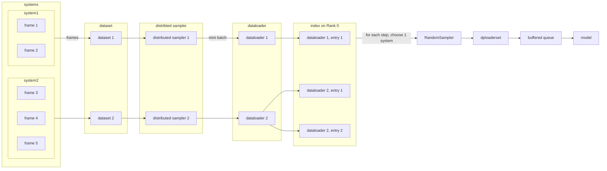

[<picture><source media="(prefers-color-scheme: dark)" srcset="./doc/_static/logo-dark.svg"><source media="(prefers-color-scheme: light)" srcset="./doc/_static/logo.svg"></picture>](./doc/logo.md)

--------------------------------------------------------------------------------

# DeePMD-kit

[](https://github.com/deepmodeling/deepmd-kit/releases)
[](https://github.com/deepmodeling/deepmd-kit/releases)
[](https://anaconda.org/conda-forge/deepmd-kit)
[](https://pypi.org/project/deepmd-kit)
[](https://hub.docker.com/r/deepmodeling/deepmd-kit)
[](https://deepmd.readthedocs.io/)

## About DeePMD-kit
DeePMD-kit is a package written in Python/C++, designed to minimize the effort required to build deep learning-based model of interatomic potential energy and force field and to perform molecular dynamics (MD). This brings new hopes to addressing the accuracy-versus-efficiency dilemma in molecular simulations. Applications of DeePMD-kit span from finite molecules to extended systems and from metallic systems to chemically bonded systems.

For more information, check the [documentation](https://deepmd.readthedocs.io/).

### Highlighted features
* **interfaced with multiple backends**, including TensorFlow and PyTorch, the most popular deep learning frameworks, making the training process highly automatic and efficient.
* **interfaced with high-performance classical MD and quantum (path-integral) MD packages**, including LAMMPS, i-PI, AMBER, CP2K, GROMACS, OpenMM, and ABUCUS.
* **implements the Deep Potential series models**, which have been successfully applied to finite and extended systems, including organic molecules, metals, semiconductors, insulators, etc.
* **implements MPI and GPU supports**, making it highly efficient for high-performance parallel and distributed computing.
* **highly modularized**, easy to adapt to different descriptors for deep learning-based potential energy models.

### License and credits
The project DeePMD-kit is licensed under [GNU LGPLv3.0](./LICENSE).
If you use this code in any future publications, please cite the following publications for general purpose:
- Han Wang, Linfeng Zhang, Jiequn Han, and Weinan E. "DeePMD-kit: A deep learning package for many-body potential energy representation and molecular dynamics." Computer Physics Communications 228 (2018): 178-184.
[](https://doi.org/10.1016/j.cpc.2018.03.016)
[](https://badge.dimensions.ai/details/doi/10.1016/j.cpc.2018.03.016)
- Jinzhe Zeng, Duo Zhang, Denghui Lu, Pinghui Mo, Zeyu Li, Yixiao Chen, Marián Rynik, Li'ang Huang, Ziyao Li, Shaochen Shi, Yingze Wang, Haotian Ye, Ping Tuo, Jiabin Yang, Ye Ding, Yifan Li, Davide Tisi, Qiyu Zeng, Han Bao, Yu Xia, Jiameng Huang, Koki Muraoka, Yibo Wang, Junhan Chang, Fengbo Yuan, Sigbjørn Løland Bore, Chun Cai, Yinnian Lin, Bo Wang, Jiayan Xu, Jia-Xin Zhu, Chenxing Luo, Yuzhi Zhang, Rhys E. A. Goodall, Wenshuo Liang, Anurag Kumar Singh, Sikai Yao, Jingchao Zhang, Renata Wentzcovitch, Jiequn Han, Jie Liu, Weile Jia, Darrin M. York, Weinan E, Roberto Car, Linfeng Zhang, Han Wang. "DeePMD-kit v2: A software package for deep potential models." J. Chem. Phys. 159 (2023): 054801.
[](https://doi.org/10.1063/5.0155600)
[](https://badge.dimensions.ai/details/doi/10.1063/5.0155600)

In addition, please follow [the bib file](CITATIONS.bib) to cite the methods you used.

### Highlights in major versions

#### Initial version
The goal of Deep Potential is to employ deep learning techniques and realize an inter-atomic potential energy model that is general, accurate, computationally efficient and scalable. The key component is to respect the extensive and symmetry-invariant properties of a potential energy model by assigning a local reference frame and a local environment to each atom. Each environment contains a finite number of atoms, whose local coordinates are arranged in a symmetry-preserving way. These local coordinates are then transformed, through a sub-network, to so-called *atomic energy*. Summing up all the atomic energies gives the potential energy of the system.

The initial proof of concept is in the [Deep Potential][1] paper, which employed an approach that was devised to train the neural network model with the potential energy only. With typical *ab initio* molecular dynamics (AIMD) datasets this is insufficient to reproduce the trajectories. The Deep Potential Molecular Dynamics ([DeePMD][2]) model overcomes this limitation. In addition, the learning process in DeePMD improves significantly over the Deep Potential method thanks to the introduction of a flexible family of loss functions. The NN potential constructed in this way reproduces accurately the AIMD trajectories, both classical and quantum (path integral), in extended and finite systems, at a cost that scales linearly with system size and is always several orders of magnitude lower than that of equivalent AIMD simulations.

Although highly efficient, the original Deep Potential model satisfies the extensive and symmetry-invariant properties of a potential energy model at the price of introducing discontinuities in the model. This has negligible influence on a trajectory from canonical sampling but might not be sufficient for calculations of dynamical and mechanical properties. These points motivated us to develop the Deep Potential-Smooth Edition ([DeepPot-SE][3]) model, which replaces the non-smooth local frame with a smooth and adaptive embedding network. DeepPot-SE shows great ability in modeling many kinds of systems that are of interest in the fields of physics, chemistry, biology, and materials science.

In addition to building up potential energy models, DeePMD-kit can also be used to build up coarse-grained models. In these models, the quantity that we want to parameterize is the free energy, or the coarse-grained potential, of the coarse-grained particles. See the [DeePCG paper][4] for more details.

#### v1

* Code refactor to make it highly modularized.
* GPU support for descriptors.

#### v2

* Model compression. Accelerate the efficiency of model inference 4-15 times.
* New descriptors. Including `se_e2_r`, `se_e3`, and `se_atten` (DPA-1).
* Hybridization of descriptors. Hybrid descriptor constructed from the concatenation of several descriptors.
* Atom type embedding. Enable atom-type embedding to decline training complexity and refine performance.
* Training and inference of the dipole (vector) and polarizability (matrix).
* Split of training and validation dataset.
* Optimized training on GPUs, including CUDA and ROCm.
* Non-von-Neumann.
* C API to interface with the third-party packages.

See [our latest paper](https://doi.org/10.1063/5.0155600) for details of all features until v2.2.3.

#### v3

* Multiple backends supported. Add a PyTorch backend.
* The DPA-2 model.

## Install and use DeePMD-kit

Please read the [online documentation](https://deepmd.readthedocs.io/) for how to install and use DeePMD-kit.

## Code structure

The code is organized as follows:

* `examples`: examples.
* `deepmd`: DeePMD-kit python modules.
* `source/lib`: source code of the core library.
* `source/op`: Operator (OP) implementation.
* `source/api_cc`: source code of DeePMD-kit C++ API.
* `source/api_c`: source code of the C API.
* `source/nodejs`: source code of the Node.js API.
* `source/ipi`: source code of i-PI client.
* `source/lmp`: source code of Lammps module.
* `source/gmx`: source code of Gromacs plugin.

# Contributing

See [DeePMD-kit Contributing Guide](CONTRIBUTING.md) to become a contributor! 🤓

# DeePMD-PyTorch (todo: need modified)
## Install

This package requires PyTorch 2.
```bash
# PyTorch 2 recommends Python >= 3.8 .

conda create -n deepmd-pt pytorch=2 torchvision torchaudio pytorch-cuda -c pytorch -c nvidia
conda activate deepmd-pt
pip install git+https://github.com/dptech-corp/deepmd-pytorch.git@devel

# OR
git clone https://github.com/dptech-corp/deepmd-pytorch.git -b devel
pip install deepmd-pytorch
```

## Run

```bash
conda activate deepmd-pt
dp_pt train tests/water/se_e2_a.json
```

## Test
```bash
dp_pt test -m model.pt -s path_to_system -n 100
dp_pt test -m model.pt -f path_to_system_file -n 100
dp_pt test -m model.pt -i path_to_input_script -n 100
```

## Running MD
```bash
conda activate deepmd-pt

# Build deepmd c API
conda install lammps eigen pytorch=2.1 -c pytorch -c nvidia
git clone https://github.com/dptech-corp/deepmd-pytorch.git -b devel
export CMAKE_PREFIX_PATH=`python -c "import torch;print(torch.__path__[0])"`/share/cmake:$CONDA_PREFIX/share/eigen3/cmake:$CMAKE_PREFIX_PATH
export PATH=/usr/local/cuda/bin:$PATH
cd deepmd-pytorch/source/api_cc
cmake -B build
cmake --build build -j

# Plugin mode: NOT implemented yet
# export LAMMPS_PLUGIN_PATH=$HOME/deepmd-pytorch/source/api_cc/build # https://docs.lammps.org/plugin.html#description

# Build lammps supporting deepmd pair style
cd -
git clone https://github.com/CaRoLZhangxy/lammps
# See modifications: https://github.com/CaRoLZhangxy/lammps/commit/27347ce4a17d13eeb634ee1c4e5fd0cc687c423f
# OR: clone lammps/lammps, move cmake/CMakeLists.txt from CaRoLZhangxy/lammps and deepmd-pytorch/source/lmp from deepmd-pytorch

# https://docs.lammps.org/Build_cmake.html#getting-started
cd lammps
mkdir build; cd build
cmake ../cmake/ -DPKG_DEEPMD=ON -DPKG_MOLECULE=ON \
    -DDEEPMD_INCLUDE_PATH=../../deepmd-pytorch/source/api_cc/include \
    -DDEEPMD_LIB_PATH=../../deepmd-pytorch/source/api_cc/build
cmake --build . -j`nproc`
make install # install to ~/.local/bin/lmp by default; shadows lmp_mpi from conda

# Run MD
export PATH=$HOME/.local/bin:$PATH
export LD_LIBRARY_PATH=`python -c "import torch;print(torch.__path__[0])"`/lib:`realpath ../../deepmd-pytorch/source/api_cc/build`:$LD_LIBRARY_PATH
cd test_example/water_768/
lmp -in sea_in.lammps
```

## Test
First modify TEST_CONFIG in env.py to the input config you want to test. For example, `tests/water/se_e2.json` is the config for a tiny water problem. The water dataset is contained in the repository.

The tests are aligned with deepmdkit 2.1.5, may fail with deepmdkit 2.2 or higher.

## Distributed Data Parallelism

Currently, we support input files in traditional dp format. We construct a PyTorch DataSet for each system, and fetch batched data with a dedicated DataLoader. This guarantee the input data for one rank in one mini-batch comes from same system, i.e. has a same number of atoms, which is required by the model. Using [`DistributedSampler`](https://pytorch.org/docs/stable/data.html#torch.utils.data.distributed.DistributedSampler), each frame is extracted for training once and only once in one epoch, no matter how many ranks there are.

The systems vary in length, and the number of mini-batches we can get from that DataLoader differs. A index table is created on each rank, and for each DataLoader, its index value is appended to the index array in the number of the length of the DataLoader. In pseudocodes:

```python
self.index: List[int] = []
self.dataloaders: List[DataLoader] = []
for system in systems:
    dl = create_dataloader(system)
    self.dataloaders.append(dl)
    for _ in range(len(dl)):  # len(dl) == how many mini-batches in this system
        index.append(len(self.dataloaders) - 1)
```

We initialize a meta-dataset named `dploaderset` with the index. Each step draws out an index randomly using `RandomSampler`, and fetch data from the corresponding DataLoader. Hence, in one epoch, the number of every DataLoader being accessed equals the length of it, which means that all input frames are accessed without omitting.



For more details, please see `deepmd-pytorch/deepmd_pt/utils/dataloader.py`.

## Run on a local cluster

We use [`torchrun`](https://pytorch.org/docs/stable/elastic/run.html#usage) to launch a DDP training session.

To start training with multiple GPUs in one node, set parameter `nproc_per_node` as the number of it:

```bash
torchrun --nproc_per_node=4 --no-python dp_pt train input.json
# Not setting `nproc_per_node` uses only 1 GPU
torchrun --no-python dp_pt train input.json
```

If you wish to execute the codes under active development without `pip install`ing, please try:

```bash
PYTHONPATH=~/deepmd-pytorch torchrun ~/deepmd-pytorch/deepmd_pt/entrypoints/main.py train input.json
```

To train a model with a cluster, one can manually launch the task using the commands below (usually this should be done by your job management system). Set `nnodes` as the number of available nodes, `node_rank` as the rank of the current node among all nodes (not the rank of processes!), and `nproc_per_node` as the number of available GPUs in one node. Please make sure that every node can access the rendezvous address and port (`rdzv_endpoint` in the command), and has a same amount of GPUs.

```bash
# Running DDP on 2 nodes with 4 GPUs each
# On node 0:
torchrun --rdzv_endpoint=node0:12321 --nnodes=2 --nproc_per_node=4 --node_rank=0 --no_python dp train tests/water/se_e2_a.json
# On node 1:
torchrun --rdzv_endpoint=node0:12321 --nnodes=2 --nproc_per_node=4 --node_rank=1 --no_python dp train tests/water/se_e2_a.json
```

> **Note** Set environment variables to tune [CPU specific optimizations](https://pytorch.org/tutorials/recipes/recipes/tuning_guide.html#cpu-specific-optimizations) in advance.

> **Note** for developers: `torchrun` by default passes settings as environment variables [(list here)](https://pytorch.org/docs/stable/elastic/run.html#environment-variables).

> To check forward, backward, and communication time, please set env var `TORCH_CPP_LOG_LEVEL=INFO TORCH_DISTRIBUTED_DEBUG=DETAIL`. More details can be found [here](https://pytorch.org/docs/stable/distributed.html#logging).


[1]: https://arxiv.org/abs/1707.01478
[2]: https://journals.aps.org/prl/abstract/10.1103/PhysRevLett.120.143001
[3]: https://arxiv.org/abs/1805.09003
[4]: https://aip.scitation.org/doi/full/10.1063/1.5027645
