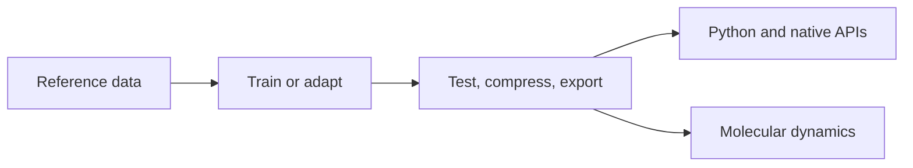

[<picture><source media="(prefers-color-scheme: dark)" srcset="./doc/_static/logo-dark.svg"><source media="(prefers-color-scheme: light)" srcset="./doc/_static/logo.svg"></picture>][logo-guide]

# DeePMD-kit

**From first-principles data to scalable molecular dynamics—through one open
framework**

[][releases]
[][releases]
[](https://anaconda.org/conda-forge/deepmd-kit)
[](https://pypi.org/project/deepmd-kit/)
[](https://hub.docker.com/r/deepmodeling/deepmd-kit)
[][documentation]
[](./LICENSE)

[**Documentation**][documentation] · [**Quick start**][quick-start] ·
[**Model guide**][model-guide] · [**Tutorials**][tutorials] ·
[**Examples**](./examples) · [**Releases**][releases]

> [!IMPORTANT]
> DeePMD-kit turns quantum-mechanical reference data into fast, scalable
> interatomic potentials. It combines modern Deep Potential architectures,
> multiple machine-learning backends, adaptation workflows, and
> simulation-ready deployment in one open-source toolkit.

Use DeePMD-kit across molecular and materials science—from finite molecules and
covalent systems to periodic solids and metals—and scale from laptop
experiments to distributed training and MPI-parallel molecular dynamics.

## ⚡ Why DeePMD-kit

|     | Advantage                           | What it unlocks                                                                                                                                                                                             |
| --- | ----------------------------------- | ----------------------------------------------------------------------------------------------------------------------------------------------------------------------------------------------------------- |
| 🧠  | **Modern model portfolio**          | Start with efficient DeepPot-SE descriptors or move to [DPA][model-guide] for large atomic models.                                                                                                          |
| 🧲  | **More than energy and force**      | Model virials, Hessians, spin and magnetic forces, dipoles, polarizabilities, electronic density of states, atomic populations, and arbitrary intensive or extensive properties.                            |
| 🧬  | **Foundation-model workflows**      | Download [pretrained DPA models][pretrained], run [multi-task learning][multi-task], fine-tune full models or LoRA adapters, extract embeddings, or adapt models to downstream properties with [DPA-ADAPT]. |
| 🔄  | **Backend flexibility**             | Train or run supported models with [TensorFlow, PyTorch, JAX, or Paddle][backends], with backend-aware model formats and conversion paths for compatible architectures.                                     |
| 🚀  | **Performance from training to MD** | Use CPUs, CUDA GPUs, ROCm source builds, distributed training, model compression, compiled DPA-4 paths, AOTInductor `.pt2` export, and MPI-enabled simulation.                                              |
| 🔌  | **Deploy where science happens**    | Use the CLI, Python, C, C++, or Node.js, then connect models to LAMMPS, i-PI, ASE, GROMACS, JAX MD, nvalchemi, OpenMM, Amber, CP2K, ABACUS, and more.                                                       |
| 🧩  | **Open and extensible**             | Compose hybrid potentials, add analytical ZBL or long-range corrections, create custom models and operators, or connect external GNNs such as MACE and NequIP through plugins.                              |

> [!TIP]
> On supported descriptors and workloads, [model compression][compression] can
> deliver more than **10× inference speedup** and reduce memory usage by as much
> as **20×**. Actual gains depend on the model, system, and hardware.

Backend and interface support varies by model and feature. The
[web documentation][documentation] marks compatibility and limitations on each
feature page.

## 🧭 One workflow, from data to dynamics


```mermaid
flowchart LR
    A["Reference data"] --> B["Train or adapt"]
    B --> C["Test, compress, export"]
    C --> D["Python and native APIs"]
    C --> E["Molecular dynamics"]
```

1. **Prepare data** in DeePMD's NumPy format or convert structures and
   trajectories with [dpdata][data].
1. **Choose a model** from DeepPot-SE, attention-based DPA models, large atomic
   models, or equivariant message-passing architectures.
1. **Train and adapt** with single-task, multi-task, fine-tuning, LoRA, or
   DPA-ADAPT workflows.
1. **Validate and export** with [`dp test`][testing], [`dp freeze`][freeze],
   backend conversion, embedding extraction, and supported compression paths.
1. **Run simulation** through Python or native APIs, or load the model into a
   supported molecular-dynamics engine.

## 🚀 Start in minutes

DeePMD-kit requires Python 3.10 or later. The fastest installation path is:

```bash
curl -fsSL https://dp1s.deepmodeling.com | bash
dp --version
dp -h
```

The [installation guide][installation] covers pip, conda-forge, containers,
offline packages, GPU builds, LAMMPS, i-PI, and source installation.

### Train a first model

Clone the examples and start with the compact water system:

```bash
git clone https://github.com/deepmodeling/deepmd-kit.git
cd deepmd-kit/examples/water/se_e2_a

# TensorFlow backend
dp train input.json

# Or PyTorch
dp --pt train input_torch.json
```

Ready-to-run inputs include:

- [DPA-3 water training](./examples/water/dpa3/input_torch.json)
- [DPA-4 water training](./examples/water/dpa4/input.json)
- [Multi-task training](./examples/water_multi_task/pytorch_example/input_torch.json)
- [DPA-ADAPT property prediction](./examples/dpa_adapt/README.md)

For a guided end-to-end example, open the [web quick-start notebook][quick-start].

### Start from a pretrained DPA model

Built-in models can be downloaded explicitly:

```bash
dp pretrained download DPA-3.2-5M
```

They can also be resolved and cached automatically by Python:

```python
from deepmd.infer import DeepPot

potential = DeepPot("DPA-3.2-5M")
```

### Fine-tune a pretrained model

Fine-tuning adapts a pretrained checkpoint to your dataset without training
from scratch:

```bash
dp pretrained download DPA-3.2-5M
dp --pt train input.json --finetune <path-to-downloaded-model> --model-branch <branch>
```

`DPA-3.2-5M` is a PyTorch multi-task checkpoint: run the trainer in PyTorch
mode with `dp --pt` and select the branch that matches your system with
`--model-branch` (list them with `dp --pt show <path> model-branch`).

The [fine-tuning guide][finetune] covers full-model and LoRA adaptation, and
[DPA-ADAPT] adapts pretrained DPA representations to downstream
property-prediction tasks.

## 🧠 Choose a model family

DeepPot-SE is a strong default: efficient, established, and broadly supported.
For large atomistic models, start with [DPA-4](https://docs.deepmodeling.com/projects/deepmd/en/latest/model/dpa4.html);
its SO(3)-equivariant message passing, LoRA fine-tuning, spin support, and
compiled deployment make it the general-purpose large atomic model.

Use the [model guide][model-guide] to compare supported backends, targets, data
formats, precision, compression, and deployment constraints.

## 🔬 Go beyond conventional force fields

| Goal                                   | DeePMD-kit capabilities                                                                                            |
| -------------------------------------- | ------------------------------------------------------------------------------------------------------------------ |
| **Potential-energy surfaces**          | Energy, atomic forces, virials, Hessians, hybrid descriptors, pair tables, and linear model combinations           |
| **Magnetic systems**                   | Spin-aware descriptors, atomic and magnetic forces, and spin-capable molecular dynamics                            |
| **Electronic and response properties** | Dipoles, polarizabilities, density of states, atomic charge populations, and custom property heads                 |
| **Long- and short-range physics**      | DPLR electrostatics, DPRc range correction for QM/MM, and analytical ZBL bridging                                  |
| **Representation learning**            | Per-atom descriptors, fitting-network features, structural embeddings, clustering, and downstream auxiliary models |

Explore the complete set of [models and physical targets][model-guide] in the
web documentation.

## 🔌 Deploy into the scientific ecosystem

### Inference interfaces

- [Python][python-inference]
- [C and C++][native-inference]
- [Node.js][node-inference]
- [Model embedding export][embeddings]

### Simulation and workflow integrations

- [LAMMPS], [i-PI][ipi], [ASE],
  [JAX MD][jax-md], and [nvalchemi]
- Ecosystem integrations for OpenMM, Amber, CP2K, GROMACS, ABACUS, DP-GEN, and
  MLatom
- External MACE and NequIP models through the DeePMD-GNN plugin

See the [integration hub][integrations] for maintained interfaces, third-party
projects, supported scope, and installation guidance.

The native C and C++ interfaces load machine-learning backends as runtime
plugins. Applications can therefore open the backend required by a model
without directly linking every framework.

> [!NOTE]
> Working with an AI coding or scientific agent? DeePMD-kit ships
> [official Agent Skills][agent-skills] for model selection, training,
> fine-tuning, Python inference, and LAMMPS workflows.

## 📚 Documentation and community

- Read the [full web documentation][documentation].
- Follow hands-on material in the [DeepModeling tutorials][tutorials].
- Browse [examples](./examples) for training, inference, and integrations.
- Ask questions or report problems in [GitHub Issues](https://github.com/deepmodeling/deepmd-kit/issues).
- Join development through the [contributing guide](./CONTRIBUTING.md).

## Citation

If DeePMD-kit contributes to published work, cite the general software paper
that matches the version used and the method-specific papers listed in
[CITATIONS.bib](./CITATIONS.bib):

- Wang et al., “DeePMD-kit: A deep learning package for many-body potential
  energy representation and molecular dynamics,” *Computer Physics
  Communications* 228 (2018), 178–184 (describes the initial version).
  [](https://doi.org/10.1016/j.cpc.2018.03.016)
  [](https://badge.dimensions.ai/details/doi/10.1016/j.cpc.2018.03.016)
- Zeng et al., “DeePMD-kit v2: A software package for Deep Potential models,”
  *The Journal of Chemical Physics* 159 (2023), 054801 (covers features until
  v2.2.3).
  [](https://doi.org/10.1063/5.0155600)
  [](https://badge.dimensions.ai/details/doi/10.1063/5.0155600)
- Zeng et al., “DeePMD-kit v3: A Multiple-Backend Framework for Machine
  Learning Potentials,” *Journal of Chemical Theory and Computation* 21
  (2025), 4375–4385 (covers features until v3.0).
  [](https://doi.org/10.1021/acs.jctc.5c00340)
  [](https://badge.dimensions.ai/details/doi/10.1021/acs.jctc.5c00340)

## License

DeePMD-kit is licensed under the
[GNU Lesser General Public License v3.0 or later](./LICENSE).

[agent-skills]: https://docs.deepmodeling.com/projects/deepmd/en/latest/agent-skills.html
[ase]: https://docs.deepmodeling.com/projects/deepmd/en/latest/third-party/ase.html
[backends]: https://docs.deepmodeling.com/projects/deepmd/en/latest/backend.html
[compression]: https://docs.deepmodeling.com/projects/deepmd/en/latest/freeze/compress.html
[data]: https://docs.deepmodeling.com/projects/deepmd/en/latest/data/dpdata.html
[documentation]: https://docs.deepmodeling.com/projects/deepmd/en/latest/
[dpa-adapt]: https://docs.deepmodeling.com/projects/deepmd/en/latest/dpa_adapt/overview.html
[embeddings]: https://docs.deepmodeling.com/projects/deepmd/en/latest/inference/embedding.html
[finetune]: https://docs.deepmodeling.com/projects/deepmd/en/latest/train/finetuning.html
[freeze]: https://docs.deepmodeling.com/projects/deepmd/en/latest/freeze/freeze.html
[installation]: https://docs.deepmodeling.com/projects/deepmd/en/latest/install/easy-install.html
[integrations]: https://docs.deepmodeling.com/projects/deepmd/en/latest/third-party/index.html
[ipi]: https://docs.deepmodeling.com/projects/deepmd/en/latest/third-party/ipi.html
[jax-md]: https://docs.deepmodeling.com/projects/deepmd/en/latest/third-party/jaxmd.html
[lammps]: https://docs.deepmodeling.com/projects/deepmd/en/latest/third-party/lammps-command.html
[logo-guide]: https://docs.deepmodeling.com/projects/deepmd/en/latest/logo.html
[model-guide]: https://docs.deepmodeling.com/projects/deepmd/en/latest/model/index.html
[multi-task]: https://docs.deepmodeling.com/projects/deepmd/en/latest/train/multi-task-training.html
[native-inference]: https://docs.deepmodeling.com/projects/deepmd/en/latest/inference/cxx.html
[node-inference]: https://docs.deepmodeling.com/projects/deepmd/en/latest/inference/nodejs.html
[nvalchemi]: https://docs.deepmodeling.com/projects/deepmd/en/latest/third-party/nvalchemi.html
[pretrained]: https://docs.deepmodeling.com/projects/deepmd/en/latest/model/pretrained.html
[python-inference]: https://docs.deepmodeling.com/projects/deepmd/en/latest/inference/python.html
[quick-start]: https://docs.deepmodeling.com/projects/deepmd/en/latest/getting-started/quick_start.html
[releases]: https://github.com/deepmodeling/deepmd-kit/releases
[testing]: https://docs.deepmodeling.com/projects/deepmd/en/latest/test/test.html
[tutorials]: https://tutorials.deepmodeling.com/
