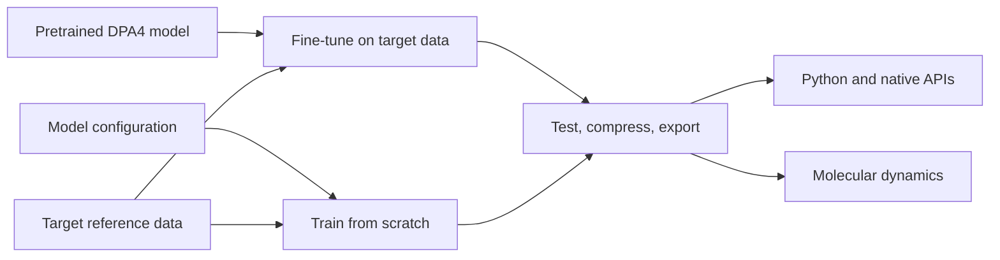

[<picture><source media="(prefers-color-scheme: dark)" srcset="./doc/_static/logo-dark.svg"><source media="(prefers-color-scheme: light)" srcset="./doc/_static/logo.svg"></picture>][logo-guide]

# DeePMD-kit

**Start from a pretrained Deep Potential model, fine-tune it for your system,
and deploy it at simulation scale.**

[][releases]
[][releases]
[](https://anaconda.org/conda-forge/deepmd-kit)
[](https://pypi.org/project/deepmd-kit/)
[](https://hub.docker.com/r/deepmodeling/deepmd-kit)
[][documentation]
[](./LICENSE)

[**Pretrained models**][pretrained] · [**Fine-tuning**][finetune] ·
[**Documentation**][documentation] · [**Quick start**][quick-start] ·
[**Model guide**][model-guide] · [**Tutorials**][tutorials] ·
[**Examples**](./examples) · [**Releases**][releases]

> [!IMPORTANT]
> **A pretrained model can be your starting point, not just your end result.**
> Download a built-in pretrained DPA4 checkpoint, fine-tune the full model for
> your system, then test, export, and deploy it through the same DeePMD-kit
> workflow.

DeePMD-kit turns quantum-mechanical reference data into fast, scalable
interatomic potentials. Use it across molecular and materials science—from
finite molecules and covalent systems to periodic solids and metals—and scale
from laptop fine-tuning to distributed training and MPI-parallel molecular
dynamics.

<p align="center">
  
</p>

<p align="center"><em>The DPA4 model family traces a Pareto frontier across Matbench Discovery CPS and saturated inference throughput.</em></p>

## ⚡ Why DeePMD-kit

|     | Advantage                           | What it unlocks                                                                                                                                                                  |
| --- | ----------------------------------- | -------------------------------------------------------------------------------------------------------------------------------------------------------------------------------- |
| 🧬  | **Pretrained-first workflows**      | Download [pretrained DPA4 models][dpa4-omat24], fine-tune full models, or adapt supported pretrained representations to downstream properties with [DPA-ADAPT].                  |
| 🏗️  | **Training from scratch**           | Design a model for a new system or physical target, then train it with single-task, multi-task, and distributed workflows across supported backends.                             |
| 🧠  | **Modern model portfolio**          | For conservative energy/force interatomic potentials, start with [DPA4] for accuracy or [DPA4C] for simulation throughput and scale.                                             |
| 🧲  | **More than energy and force**      | Model virials, Hessians, spin and magnetic forces, dipoles, polarizabilities, electronic density of states, atomic populations, and arbitrary intensive or extensive properties. |
| 🔄  | **Backend flexibility**             | Train or run supported models with [TensorFlow, PyTorch, JAX, or Paddle][backends], with backend-aware model formats and conversion paths for compatible architectures.          |
| 🚀  | **Performance from training to MD** | Use CPUs, CUDA GPUs, ROCm source builds, distributed training, compiled DPA4 paths, compressed DPA4C CUDA inference, AOTInductor `.pt2` export, and MPI-enabled simulation.      |
| 🔌  | **Deploy where science happens**    | Use the CLI, Python, C, C++, or Node.js, then connect models to LAMMPS, i-PI, ASE, GROMACS, JAX MD, nvalchemi, OpenMM, Amber, CP2K, ABACUS, and more.                            |
| 🧩  | **Open and extensible**             | Compose hybrid potentials, add analytical ZBL or long-range corrections, create custom models and operators, or connect external GNNs such as MACE and NequIP through plugins.   |

> [!TIP]
> On supported descriptors and workloads, [model compression][compression] can
> deliver more than **10× inference speedup** and reduce memory usage by as much
> as **20×**. Actual gains depend on the model, system, and hardware.

Backend and interface support varies by model and feature. The
[web documentation][documentation] marks compatibility and limitations on each
feature page.

## 🧭 Two starting points, one path to dynamics


```mermaid
flowchart LR
    A["Pretrained DPA4 model"] --> C["Fine-tune on target data"]
    B["Model configuration"] --> D["Train from scratch"]
    E["Target reference data"] --> C
    E --> D
    C --> F["Test, compress, export"]
    D --> F
    F --> G["Python and native APIs"]
    F --> H["Molecular dynamics"]
```

1. **Choose a starting point:** download a pretrained DPA4 checkpoint for
   adaptation, or configure DPA4 or DPA4C to train from scratch.
1. **Prepare target data** in DeePMD's NumPy format or convert structures and
   trajectories with [dpdata][data].
1. **Fine-tune or train:** adapt the full pretrained DPA4 model, or optimize a
   new DPA4 or DPA4C model with single-task, multi-task, and distributed
   training workflows.
1. **Validate and export** with [`dp test`][testing], [`dp freeze`][freeze],
   backend conversion, embedding extraction, and supported compression paths.
1. **Run simulation** through Python or native APIs, or load the model into a
   supported molecular-dynamics engine.

## 🚀 Start in minutes

DeePMD-kit requires Python 3.10 or later. The fastest installation path is:

```bash
curl -fsSL https://dp1s.deepmodeling.com | bash
dp --version
dp -h
```

The [installation guide][installation] covers pip, conda-forge, containers,
offline packages, GPU builds, LAMMPS, i-PI, and source installation.

### Fine-tune a pretrained DPA4 model

Download a built-in checkpoint, start from its matching released training
configuration, and fine-tune it on your target data. This example uses DPA4-Neo,
one of the recommended general-purpose sizes:

```bash
dp pretrained download DPA4-Neo-OMat24-v20260805
curl -fsSL \
    https://huggingface.co/deepmodelingcommunity/DPA4-OMat24/resolve/main/DPA4-Neo-OMat24-v20260805.json \
    -o input_finetune.json
```

The [DPA4 OMat24 release][dpa4-omat24] provides Nano, Mini, Neo, Air, and Plus
checkpoints together with their matching training configurations. The downloaded
`input_finetune.json` matches the Neo checkpoint above; for another size or
version, use the correspondingly named JSON file. Keep its complete `model`
section unchanged, including the full-periodic-table `type_map`; replace the
training and validation data, and use a smaller learning rate for fine-tuning.
Then run:

```bash
dp --pt train input_finetune.json \
    --finetune ~/.cache/deepmd/pretrained/models/DPA4-Neo-OMat24-v20260805.pt
```

These are PyTorch single-task checkpoints, so no model branch selection is
needed. They target inorganic materials in the OMat24 chemical space; validate
accuracy before using them outside that domain.

The [fine-tuning guide][finetune] covers full-model adaptation. [DPA-ADAPT]
reuses supported pretrained DPA representations for downstream
property-prediction tasks.

Pretrained model names can also be resolved and cached automatically by
Python:

```python
from deepmd.infer import DeepPot

potential = DeepPot("DPA4-Neo-OMat24-v20260805")
```

### Train a model from scratch

Training from scratch remains a first-class workflow for new architectures,
fully custom systems, and physical targets without a suitable pretrained
checkpoint. Clone the examples and start with the compact water system:

```bash
git clone https://github.com/deepmodeling/deepmd-kit.git
cd deepmd-kit/examples/water/dpa4

# Accuracy-first DPA4 model
dp --pt train input.json

# Or the throughput-first DPA4C model
cd ../dpa4c
dp --pt-expt train input.json
```

Ready-to-run inputs include:

- [DPA4 water training](./examples/water/dpa4/input.json)
- [DPA4C high-throughput water training](./examples/water/dpa4c/input.json)
- [DPA4 multi-task training](./examples/water/dpa4/input_multitask.json)
- [DPA-ADAPT property prediction](./examples/dpa_adapt/README.md)

For a guided end-to-end example, open the [web quick-start notebook][quick-start].

## 🧠 Choose a model family

For conservative energy/force interatomic potentials, start with the DPA4
family. The choice between its two primary models follows the constraint that
matters most for your workload:

| Priority                           | Start with | Why                                                                                                  |
| ---------------------------------- | ---------- | ---------------------------------------------------------------------------------------------------- |
| Highest accuracy                   | [DPA4]     | SO(3)-equivariant message passing targets the accuracy frontier.                                     |
| Highest throughput or system scale | [DPA4C]    | A compact one-hop descriptor targets the throughput frontier and supports compressed CUDA inference. |

DPA4 uses the PyTorch backend (`dp --pt`). DPA4C currently uses the PyTorch
Exportable backend (`dp --pt-expt`); its compressed CUDA path requires
`float32`.

For other physical targets, use the [model guide][model-guide] to select a
compatible model and backend. The guide also compares data formats, precision,
compression, and deployment constraints.

<p align="center">
  
</p>

<p align="center"><em>For energy/force potentials, DPA4 and DPA4C span accuracy–throughput trade-offs for different deployment budgets.</em></p>

## 🔬 Go beyond conventional force fields

| Goal                                   | DeePMD-kit capabilities                                                                                            |
| -------------------------------------- | ------------------------------------------------------------------------------------------------------------------ |
| **Potential-energy surfaces**          | Energy, atomic forces, virials, Hessians, hybrid descriptors, pair tables, and linear model combinations           |
| **Magnetic systems**                   | Spin-aware descriptors, atomic and magnetic forces, and spin-capable molecular dynamics                            |
| **Electronic and response properties** | Dipoles, polarizabilities, density of states, atomic charge populations, and custom property heads                 |
| **Long- and short-range physics**      | DPLR electrostatics, DPRc range correction for QM/MM, and analytical ZBL bridging                                  |
| **Representation learning**            | Per-atom descriptors, fitting-network features, structural embeddings, clustering, and downstream auxiliary models |

Explore the complete set of [models and physical targets][model-guide] in the
web documentation.

## 🔌 Deploy into the scientific ecosystem

### Inference interfaces

- [Python][python-inference]
- [C and C++][native-inference]
- [Node.js][node-inference]
- [Model embedding export][embeddings]

### Simulation and workflow integrations

- [LAMMPS], [i-PI][ipi], [ASE],
  [JAX MD][jax-md], and [nvalchemi]
- Ecosystem integrations for OpenMM, Amber, CP2K, GROMACS, ABACUS, DP-GEN, and
  MLatom
- External MACE and NequIP models through the DeePMD-GNN plugin

See the [integration hub][integrations] for maintained interfaces, third-party
projects, supported scope, and installation guidance.

The native C and C++ interfaces load machine-learning backends as runtime
plugins. Applications can therefore open the backend required by a model
without directly linking every framework.

> [!NOTE]
> Working with an AI coding or scientific agent? DeePMD-kit ships
> [official Agent Skills][agent-skills] for model selection, training,
> fine-tuning, Python inference, and LAMMPS workflows.

## 📚 Documentation and community

- Read the [full web documentation][documentation].
- Follow hands-on material in the [DeepModeling tutorials][tutorials].
- Browse [examples](./examples) for training, inference, and integrations.
- Ask questions or report problems in [GitHub Issues](https://github.com/deepmodeling/deepmd-kit/issues).
- Join development through the [contributing guide](./CONTRIBUTING.md).

## Citation

If DeePMD-kit contributes to published work, cite the general software paper
that matches the version used and the method-specific papers listed in
[CITATIONS.bib](./CITATIONS.bib):

- Wang et al., “DeePMD-kit: A deep learning package for many-body potential
  energy representation and molecular dynamics,” *Computer Physics
  Communications* 228 (2018), 178–184 (describes the initial version).
  [](https://doi.org/10.1016/j.cpc.2018.03.016)
  [](https://badge.dimensions.ai/details/doi/10.1016/j.cpc.2018.03.016)
- Zeng et al., “DeePMD-kit v2: A software package for Deep Potential models,”
  *The Journal of Chemical Physics* 159 (2023), 054801 (covers features until
  v2.2.3).
  [](https://doi.org/10.1063/5.0155600)
  [](https://badge.dimensions.ai/details/doi/10.1063/5.0155600)
- Zeng et al., “DeePMD-kit v3: A Multiple-Backend Framework for Machine
  Learning Potentials,” *Journal of Chemical Theory and Computation* 21
  (2025), 4375–4385 (covers features until v3.0).
  [](https://doi.org/10.1021/acs.jctc.5c00340)
  [](https://badge.dimensions.ai/details/doi/10.1021/acs.jctc.5c00340)

## License

DeePMD-kit is licensed under the
[GNU Lesser General Public License v3.0 or later](./LICENSE).

[agent-skills]: https://docs.deepmodeling.com/projects/deepmd/en/latest/agent-skills.html
[ase]: https://docs.deepmodeling.com/projects/deepmd/en/latest/third-party/ase.html
[backends]: https://docs.deepmodeling.com/projects/deepmd/en/latest/backend.html
[compression]: https://docs.deepmodeling.com/projects/deepmd/en/latest/freeze/compress.html
[data]: https://docs.deepmodeling.com/projects/deepmd/en/latest/data/dpdata.html
[documentation]: https://docs.deepmodeling.com/projects/deepmd/en/latest/
[dpa-adapt]: https://docs.deepmodeling.com/projects/deepmd/en/latest/dpa_adapt/overview.html
[dpa4]: https://docs.deepmodeling.com/projects/deepmd/en/latest/model/dpa4.html
[dpa4-omat24]: https://huggingface.co/deepmodelingcommunity/DPA4-OMat24
[dpa4c]: https://docs.deepmodeling.com/projects/deepmd/en/latest/model/dpa4c.html
[embeddings]: https://docs.deepmodeling.com/projects/deepmd/en/latest/inference/embedding.html
[finetune]: https://docs.deepmodeling.com/projects/deepmd/en/latest/train/finetuning.html
[freeze]: https://docs.deepmodeling.com/projects/deepmd/en/latest/freeze/freeze.html
[installation]: https://docs.deepmodeling.com/projects/deepmd/en/latest/install/easy-install.html
[integrations]: https://docs.deepmodeling.com/projects/deepmd/en/latest/third-party/index.html
[ipi]: https://docs.deepmodeling.com/projects/deepmd/en/latest/third-party/ipi.html
[jax-md]: https://docs.deepmodeling.com/projects/deepmd/en/latest/third-party/jaxmd.html
[lammps]: https://docs.deepmodeling.com/projects/deepmd/en/latest/third-party/lammps-command.html
[logo-guide]: https://docs.deepmodeling.com/projects/deepmd/en/latest/logo.html
[model-guide]: https://docs.deepmodeling.com/projects/deepmd/en/latest/model/index.html
[native-inference]: https://docs.deepmodeling.com/projects/deepmd/en/latest/inference/cxx.html
[node-inference]: https://docs.deepmodeling.com/projects/deepmd/en/latest/inference/nodejs.html
[nvalchemi]: https://docs.deepmodeling.com/projects/deepmd/en/latest/third-party/nvalchemi.html
[pretrained]: https://docs.deepmodeling.com/projects/deepmd/en/latest/model/pretrained.html
[python-inference]: https://docs.deepmodeling.com/projects/deepmd/en/latest/inference/python.html
[quick-start]: https://docs.deepmodeling.com/projects/deepmd/en/latest/getting-started/quick_start.html
[releases]: https://github.com/deepmodeling/deepmd-kit/releases
[testing]: https://docs.deepmodeling.com/projects/deepmd/en/latest/test/test.html
[tutorials]: https://tutorials.deepmodeling.com/
