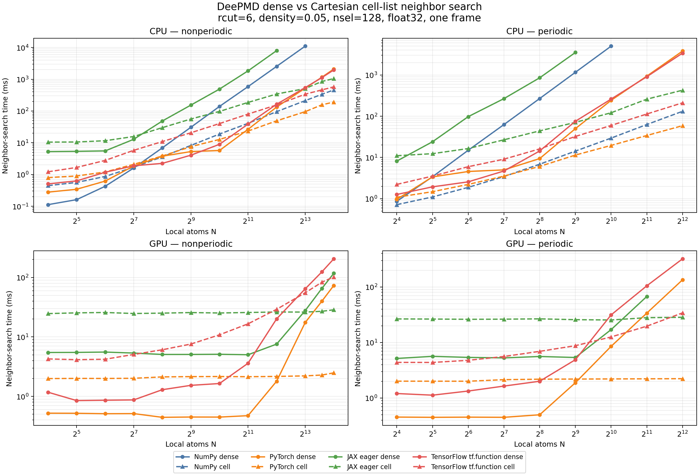
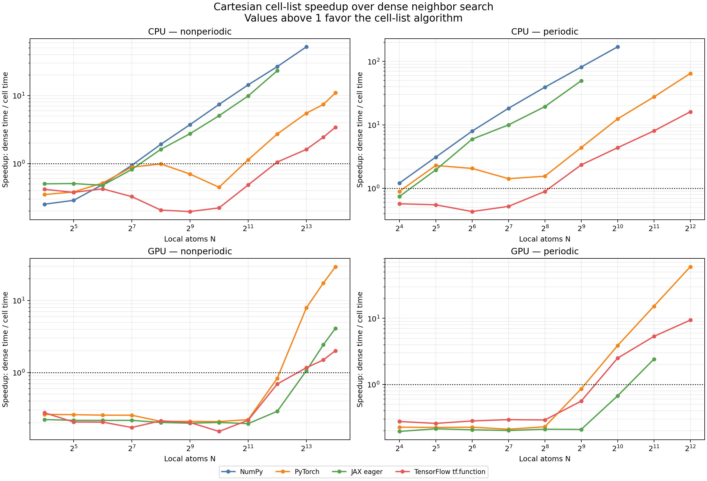

# Default neighbor-list benchmark at `rcut=6`

This benchmark compares the historical dense all-pairs neighbor search with the
Cartesian cell-list implementation in `DefaultNeighborList`.





## Methodology

- `rcut=6`, one frame, `float32`, `nsel=128`.
- Uniform random coordinates at number density `0.05`.
- Periodic and non-periodic systems are measured separately.
- Periodic ghost coordinates are constructed once before timing. The plots
  therefore compare the two search algorithms rather than their shared ghost
  extension cost.
- Each shape and implementation is warmed once. The reported value is the
  median of an adaptive 1--15 timed repetitions with an explicit device
  synchronization.
- NumPy, PyTorch, and JAX use their eager neighbor-list path. TensorFlow uses
  `tf.function`, matching its graph execution path.

Hardware and software:

- CPU: AMD EPYC 7K62, 48 cores.
- GPU: NVIDIA GeForce RTX 5090, 32607 MiB.
- Python 3.13.9, NumPy 2.5.1, PyTorch 2.12.1+cu129, JAX 0.8.0,
  TensorFlow 2.21.0.
- TensorFlow 2.21.0 did not contain native compute-capability 12.0a kernels, so
  its first GPU execution compiled PTX. Compilation is excluded by warm-up.

The complete measurements are available in
[`default_neighbor_list_benchmark_rcut6.csv`](default_neighbor_list_benchmark_rcut6.csv).
They can be reproduced with
[`benchmark_default_neighbor_list.py`](../../source/tests/common/dpmodel/benchmark_default_neighbor_list.py)
and plotted with
[`plot_default_neighbor_list_benchmark.py`](plot_default_neighbor_list_benchmark.py).

## Measured crossover

The table reports the first measured local atom count where the cell list is no
slower than the dense implementation. NumPy has no GPU row.

| Backend                  | CPU non-periodic | CPU periodic | GPU non-periodic | GPU periodic |
| ------------------------ | ---------------: | -----------: | ---------------: | -----------: |
| NumPy                    |              256 |           16 |                - |            - |
| PyTorch                  |             2048 |           32 |             8192 |         1024 |
| JAX eager                |              256 |           32 |             8192 |         2048 |
| TensorFlow `tf.function` |             4096 |          512 |             8192 |         1024 |

The automatic dispatcher uses conservative thresholds covering both the earlier
`rcut=3` measurements and this `rcut=6` benchmark. This avoids selecting the
cell list in a range where a backend's dense broadcast remains faster.

## Scaling observations

- Dense memory and runtime grow quadratically with the number of local/extended
  atom pairs. JAX GPU dense search ran out of 32 GiB device memory for the
  periodic `N=4096`, `nall=110592` case.

- At fixed density, cell-list runtime grows approximately linearly once backend
  launch and synchronization overheads are amortized.

- A larger cutoff increases the average number of atoms in the 27 queried cells.
  Consequently, the crossover is backend- and cutoff-dependent rather than a
  universal atom count.

- At the largest common successful measurements, the cell-list speedups were:

  - CPU non-periodic: NumPy 52.1x, PyTorch 11.0x, JAX 23.2x,
    TensorFlow 3.4x.
  - CPU periodic: NumPy 169.6x, PyTorch 64.5x, JAX 49.5x,
    TensorFlow 16.1x.
  - GPU non-periodic at `N=16384`: PyTorch 29.5x, JAX 4.1x,
    TensorFlow 2.0x.
  - GPU periodic: PyTorch 60.3x and TensorFlow 9.4x at `N=4096`; JAX
    2.4x at `N=2048` before the next dense size ran out of memory.

All successful dense/cell comparisons contained the same neighbor set. Three
large PyTorch CPU cases differed only by the order of two equal-distance
`float32` neighbors in one center; no neighbor membership differed.

## Example commands

CPU:

```bash
python source/tests/common/dpmodel/benchmark_default_neighbor_list.py \
    --backend torch --device cpu --scenario periodic \
    --output result_torch_cpu_periodic.csv
```

GPU:

```bash
srun --gres=gpu:1 python \
    source/tests/common/dpmodel/benchmark_default_neighbor_list.py \
    --backend jax --device gpu --scenario nonperiodic \
    --output result_jax_gpu_nonperiodic.csv
```

Generate both plots from a directory containing the resulting `result_*.csv`
files:

```bash
python doc/development/plot_default_neighbor_list_benchmark.py <results-dir>
```
