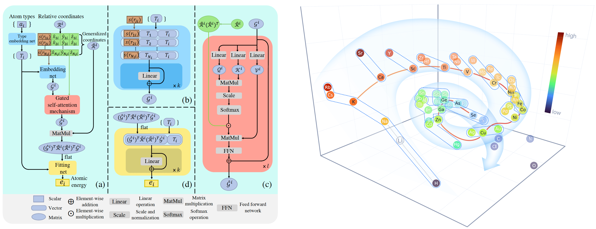

# Descriptor `"se_atten"` {{ tensorflow_icon }} {{ pytorch_icon }}

:::{note}
**Supported backends**: TensorFlow {{ tensorflow_icon }}, PyTorch {{ pytorch_icon }}
:::

## DPA-1: Pretraining of Attention-based Deep Potential Model for Molecular Simulation



Here we propose DPA-1, a Deep Potential model with a novel attention mechanism, which is highly effective for representing the conformation and chemical spaces of atomic systems and learning the PES.

See [this paper](https://arxiv.org/abs/2208.08236) for more information. DPA-1 is implemented as a new descriptor `"se_atten"` for model training, which can be used after simply editing the input.json.

## Theory

Attention-based descriptor $\mathcal{D}^i \in \mathbb{R}^{M \times M_{<}}$, which is proposed in pretrainable DPA-1 model, is given by

```math
    \mathcal{D}^i = \frac{1}{N_c^2}(\hat{\mathcal{G}}^i)^T \mathcal{R}^i (\mathcal{R}^i)^T \hat{\mathcal{G}}^i_<,
```

where $\hat{\mathcal{G}}^i$ represents the embedding matrix $\mathcal{G}^i$ after additional self-attention mechanism and $\mathcal{R}^i$ is defined by the full case in the [`se_e2_a`](./train-se-e2-a.md). Note that we obtain $\mathcal{G}^i$ using the type embedding method by default in this descriptor. By default, we concat $s(r_{ij})$ and the type embeddings of central and neighboring atoms $\mathcal{A}^i$ and $\mathcal{A}^j$ as input of the embedding network $\mathcal{N}_{e,2}$:

```math
   (\mathcal{G}^i)_j = \mathcal{N}_{e,2}(\{s(r_{ij}), \mathcal{A}^i, \mathcal{A}^j\})  \quad \mathrm{or}\quad(\mathcal{G}^i)_j = \mathcal{N}_{e,2}(\{s(r_{ij}), \mathcal{A}^j\})
```

To perform the self-attention mechanism, the queries $\mathcal{Q}^{i,l} \in \mathbb{R}^{N_c\times d_k}$, keys $\mathcal{K}^{i,l} \in \mathbb{R}^{N_c\times d_k}$, and values $\mathcal{V}^{i,l} \in \mathbb{R}^{N_c\times d_v}$ are first obtained:

```math
    \left(\mathcal{Q}^{i,l}\right)_{j}=Q_{l}\left(\left(\mathcal{G}^{i,l-1}\right)_{j}\right),
```

```math
    \left(\mathcal{K}^{i,l}\right)_{j}=K_{l}\left(\left(\mathcal{G}^{i,l-1}\right)_{j}\right),
```

```math
    \left(\mathcal{V}^{i,l}\right)_{j}=V_{l}\left(\left(\mathcal{G}^{i,l-1}\right)_{j}\right),
```

where $Q_{l}$, $K_{l}$, $V_{l}$ represent three trainable linear transformations that output the queries and keys of dimension $d_k$ and values of dimension $d_v$, and $l$ is the index of the attention layer.
The input embedding matrix to the attention layers, denoted by $\mathcal{G}^{i,0}$, is chosen as the two-body embedding matrix.

Then the scaled dot-product attention method is adopted:

```math
A(\mathcal{Q}^{i,l}, \mathcal{K}^{i,l}, \mathcal{V}^{i,l}, \mathcal{R}^{i,l})=\varphi\left(\mathcal{Q}^{i,l}, \mathcal{K}^{i,l},\mathcal{R}^{i,l}\right)\mathcal{V}^{i,l},
```

where $\varphi\left(\mathcal{Q}^{i,l}, \mathcal{K}^{i,l},\mathcal{R}^{i,l}\right) \in \mathbb{R}^{N_c\times N_c}$ is attention weights.
In the original attention method, one typically has $\varphi\left(\mathcal{Q}^{i,l}, \mathcal{K}^{i,l}\right)=\mathrm{softmax}\left(\frac{\mathcal{Q}^{i,l} (\mathcal{K}^{i,l})^{T}}{\sqrt{d_{k}}}\right)$, with $\sqrt{d_{k}}$ being the normalization temperature.
This is slightly modified to incorporate the angular information:

```math
\varphi\left(\mathcal{Q}^{i,l}, \mathcal{K}^{i,l},\mathcal{R}^{i,l}\right) = \mathrm{softmax}\left(\frac{\mathcal{Q}^{i,l} (\mathcal{K}^{i,l})^{T}}{\sqrt{d_{k}}}\right) \odot \hat{\mathcal{R}}^{i}(\hat{\mathcal{R}}^{i})^{T},
```

where $\hat{\mathcal{R}}^{i} \in \mathbb{R}^{N_c\times 3}$ denotes normalized relative coordinates , $\hat{\mathcal{R}}^{i}_{j} = \frac{\boldsymbol{r}_{ij}}{\lVert \boldsymbol{r}_{ij} \lVert}$ and $\odot$ means element-wise multiplication.

Then layer normalization is added in a residual way to finally obtain the self-attention local embedding matrix $\hat{\mathcal{G}}^{i} = \mathcal{G}^{i,L_a}$ after $L_a$ attention layers:[^1]

```math
\mathcal{G}^{i,l} = \mathcal{G}^{i,l-1} + \mathrm{LayerNorm}(A(\mathcal{Q}^{i,l}, \mathcal{K}^{i,l}, \mathcal{V}^{i,l}, \mathcal{R}^{i,l})).
```

[^1]: This section is built upon Jinzhe Zeng, Duo Zhang, Denghui Lu, Pinghui Mo, Zeyu Li, Yixiao Chen, Marián Rynik, Li'ang Huang, Ziyao Li, Shaochen Shi, Yingze Wang, Haotian Ye, Ping Tuo, Jiabin Yang, Ye Ding, Yifan Li, Davide Tisi, Qiyu Zeng, Han Bao, Yu Xia, Jiameng Huang, Koki Muraoka, Yibo Wang, Junhan Chang, Fengbo Yuan, Sigbjørn Løland Bore, Chun Cai, Yinnian Lin, Bo Wang, Jiayan Xu, Jia-Xin Zhu, Chenxing Luo, Yuzhi Zhang, Rhys E. A. Goodall, Wenshuo Liang, Anurag Kumar Singh, Sikai Yao, Jingchao Zhang, Renata Wentzcovitch, Jiequn Han, Jie Liu, Weile Jia, Darrin M. York, Weinan E, Roberto Car, Linfeng Zhang, Han Wang, [J. Chem. Phys. 159, 054801 (2023)](https://doi.org/10.1063/5.0155600) licensed under a [Creative Commons Attribution (CC BY) license](http://creativecommons.org/licenses/by/4.0/).

## Introduction to new features of DPA-1

Next, we will list the detailed settings in input.json and the data format, especially for large systems with dozens of elements. An example of DPA-1 input can be found [here](../../examples/water/se_atten/input.json).

### Descriptor `"se_atten"`

The notation of `se_atten` is short for the smooth edition of Deep Potential with an attention mechanism.
This descriptor was described in detail in [the DPA-1 paper](https://arxiv.org/abs/2208.08236) and the images above.

In this example, we will train a DPA-1 model for a water system. A complete training input script of this example can be found in the directory:

```bash
$deepmd_source_dir/examples/water/se_atten/input.json
```

With the training input script, data are also provided in the example directory. One may train the model with the DeePMD-kit from the directory.

An example of the DPA-1 descriptor is provided as follows

::::{tab-set}

:::{tab-item} TensorFlow {{ tensorflow_icon }}

```json
	"descriptor" :{
          "type":		"se_atten",
          "rcut_smth":	0.50,
          "rcut":		6.00,
          "sel":		120,
          "neuron":		[25, 50, 100],
          "axis_neuron":	16,
          "resnet_dt":	false,
          "attn":	128,
          "attn_layer":	2,
          "attn_mask":	false,
          "attn_dotr":	true,
          "seed":	1
	}
```

- The {ref}`type <model/descriptor/type>` of the descriptor is set to `"se_atten"`, which will use DPA-1 structures.
- {ref}`rcut <model/descriptor[se_atten]/rcut>` is the cut-off radius for neighbor searching, and the {ref}`rcut_smth <model/descriptor[se_atten]/rcut_smth>` gives where the smoothing starts.
- **{ref}`sel <model/descriptor[se_atten]/sel>`** gives the maximum possible number of neighbors in the cut-off radius. It is an int. Note that this number highly affects the efficiency of training, which we usually use less than 200. (We use 120 for training 56 elements in [OC2M dataset](https://github.com/Open-Catalyst-Project/ocp/blob/main/DATASET.md))
- The {ref}`neuron <model/descriptor[se_atten]/neuron>` specifies the size of the embedding net. From left to right the members denote the sizes of each hidden layer from the input end to the output end, respectively. If the outer layer is twice the size of the inner layer, then the inner layer is copied and concatenated, then a [ResNet architecture](https://arxiv.org/abs/1512.03385) is built between them.
- The {ref}`axis_neuron <model/descriptor[se_atten]/axis_neuron>` specifies the size of the submatrix of the embedding matrix, the axis matrix as explained in the [DeepPot-SE paper](https://arxiv.org/abs/1805.09003)
- If the option {ref}`resnet_dt <model/descriptor[se_atten]/resnet_dt>` is set to `true`, then a timestep is used in the ResNet.
- {ref}`seed <model/descriptor[se_atten]/seed>` gives the random seed that is used to generate random numbers when initializing the model parameters.
- {ref}`attn <model/descriptor[se_atten]/attn>` sets the length of a hidden vector during scale-dot attention computation.
- {ref}`attn_layer <model/descriptor[se_atten]/attn_layer>` sets the number of layers in attention mechanism.
- {ref}`attn_mask <model/descriptor[se_atten]/attn_mask>` determines whether to mask the diagonal in the attention weights and False is recommended.
- {ref}`attn_dotr <model/descriptor[se_atten]/attn_dotr>` determines whether to dot the relative coordinates on the attention weights as a gated scheme, True is recommended.

:::

:::{tab-item} PyTorch {{ pytorch_icon }}

```json
	"descriptor" :{
          "type":		"dpa1",
          "rcut_smth":	0.50,
          "rcut":		6.00,
          "sel":		120,
          "neuron":		[25, 50, 100],
          "tebd_dim": 8,
          "axis_neuron":	16,
          "attn":	128,
          "attn_layer":	2,
          "attn_mask": false,
          "attn_dotr": true,
	}
```

- The {ref}`type <model/descriptor/type>` of the descriptor is set to `"dpa1"`, which will use DPA-1 structures.
- {ref}`rcut <model/descriptor[se_atten]/rcut>` is the cut-off radius for neighbor searching, and the {ref}`rcut_smth <model/descriptor[se_atten]/rcut_smth>` gives where the smoothing starts.
- **{ref}`sel <model/descriptor[se_atten]/sel>`** gives the maximum possible number of neighbors in the cut-off radius. It is an int. Note that this number highly affects the efficiency of training, which we usually use less than 200. (We use 120 for training 56 elements in [OC2M dataset](https://github.com/Open-Catalyst-Project/ocp/blob/main/DATASET.md))
- The {ref}`neuron <model/descriptor[se_atten]/neuron>` specifies the size of the embedding net. From left to right the members denote the sizes of each hidden layer from the input end to the output end, respectively. If the outer layer is twice the size of the inner layer, then the inner layer is copied and concatenated, then a [ResNet architecture](https://arxiv.org/abs/1512.03385) is built between them.
- The {ref}`tebd_dim <model/descriptor[se_atten]/tebd_dim>` specifies the dimension of the type embedding.
- The {ref}`axis_neuron <model/descriptor[se_atten]/axis_neuron>` specifies the size of the submatrix of the embedding matrix, the axis matrix as explained in the [DeepPot-SE paper](https://arxiv.org/abs/1805.09003)
- {ref}`attn <model/descriptor[se_atten]/attn>` sets the length of a hidden vector during scale-dot attention computation.
- {ref}`attn_layer <model/descriptor[se_atten]/attn_layer>` sets the number of layers in attention mechanism.
- {ref}`attn_mask <model/descriptor[se_atten]/attn_mask>` determines whether to mask the diagonal in the attention weights and False is recommended.
- {ref}`attn_dotr <model/descriptor[se_atten]/attn_dotr>` determines whether to dot the relative coordinates on the attention weights as a gated scheme, True is recommended.

:::

::::

### Descriptor `"se_atten_v2"`

We highly recommend using the version 2.0 of the attention-based descriptor `"se_atten_v2"`, which is inherited from `"se_atten"` but with the following parameter modifications:

```json
      "tebd_input_mode": "strip",
      "smooth_type_embedding": true,
      "set_davg_zero": false
```

The `tebd_input_mode` can take `"concat"` and `"strip"` as values. The default value in `"se_atten_v2"` is `"strip"`. When `tebd_input_mode` is set to `"strip"`, the embedding matrix $\mathcal{G}^i$ is constructed as:

```math
   (\mathcal{G}^i)_j = \mathcal{N}_{e,2}(s(r_{ij})) + \mathcal{N}_{e,2}(s(r_{ij})) \odot ({N}_{e,2}(\{\mathcal{A}^i, \mathcal{A}^j\}) \odot s(r_{ij})) \quad \mathrm{or}\quad (\mathcal{G}^i)_j = \mathcal{N}_{e,2}(s(r_{ij})) + \mathcal{N}_{e,2}(s(r_{ij})) \odot ({N}_{e,2}(\{\mathcal{A}^j\}) \odot s(r_{ij}))
```

Practical evidence demonstrates that `"se_atten_v2"` offers better and more stable performance compared to `"se_atten"`.

Notice: Model compression for the `se_atten_v2` descriptor is exclusively designed for models with the training parameter {ref}`attn_layer <model/descriptor[se_atten_v2]/attn_layer>` set to 0.

### Fitting `"ener"`

DPA-1 only supports `"ener"` fitting type, and you can refer [here](train-energy.md) for detailed information.

### Type embedding

DPA-1 only supports models with type embeddings. And the default setting is as follows:

```json
"type_embedding":{
            "neuron":           [8],
            "resnet_dt":        false,
            "seed":             1
        }
```

You can add these settings in input.json if you want to change the default ones, see [here](train-se-e2-a-tebd.md) for detailed information.

### Type map

For training large systems, especially those with dozens of elements, the {ref}`type <model/type_map>` determines the element index of training data:

```json
"type_map": [
   "Mg",
   "Al",
   "Cu"
  ]
```

which should include all the elements in the dataset you want to train on.

## Data format

DPA-1 supports the standard data format, which is detailed in [data-conv.md](../data/data-conv.md) and [system.md](../data/system.md).
Note that in this format, only those frames with the same fingerprint (i.e. the number of atoms of different elements) can be put together as a unified system.
This may lead to sparse frame numbers in those rare systems.

An ideal way is to put systems with the same total number of atoms together, which is the way we trained DPA-1 on [OC2M](https://github.com/Open-Catalyst-Project/ocp/blob/main/DATASET.md).
This system format, which is called `mixed_type`, is proper to put frame-sparse systems together and is slightly different from the standard one.
Take an example, a `mixed_type` may contain the following files:

```
type.raw
type_map.raw
set.*/box.npy
set.*/coord.npy
set.*/energy.npy
set.*/force.npy
set.*/real_atom_types.npy
```

This system contains `Nframes` frames with the same atom number `Natoms`, the total number of element types contained in all frames is `Ntypes`. Most files are the same as those in [standard formats](../data/system.md), here we only list the distinct ones:

| ID       | Property                         | File                | Required/Optional | Shape             | Description                                                                                                              |
| -------- | -------------------------------- | ------------------- | ----------------- | ----------------- | ------------------------------------------------------------------------------------------------------------------------ |
| /        | Atom type indexes (place holder) | type.raw            | Required          | Natoms            | All zeros to fake the type input                                                                                         |
| type_map | Atom type names                  | type_map.raw        | Required          | Ntypes            | Atom names that map to atom type contained in all the frames, which is unnecessart to be contained in the periodic table |
| type     | Atom type indexes of each frame  | real_atom_types.npy | Required          | Nframes \* Natoms | Integers that describe atom types in each frame, corresponding to indexes in type_map. `-1` means virtual atoms.         |

With these edited files, one can put together frames with the same `Natoms`, instead of the same formula (like `H2O`). Note that this `mixed_type` format only supports `se_atten` descriptor.

To put frames with different `Natoms` into the same system, one can pad systems by adding virtual atoms whose type is `-1`. Virtual atoms do not contribute to any fitting property, so the atomic property of virtual atoms (e.g. forces) should be given zero.

The API to generate or transfer to `mixed_type` format is available on [dpdata](https://github.com/deepmodeling/dpdata) for a more convenient experience.

## Training example

Here we upload the AlMgCu example shown in the paper, you can download it here:
[Baidu disk](https://pan.baidu.com/s/1Mk9CihPHCmf8quwaMhT-nA?pwd=d586);
[Google disk](https://drive.google.com/file/d/11baEpRrvHoqxORFPSdJiGWusb3Y4AnRE/view?usp=sharing).
