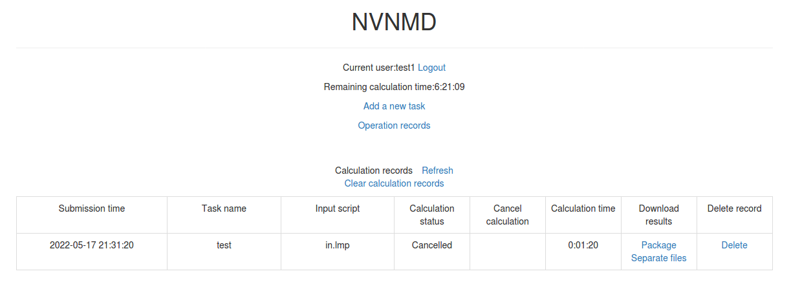

# Introduction

NVNMD stands for non-von Neumann molecular dynamics.

This is the training code we used to generate the results in our paper entitled "Accurate and Efficient Molecular Dynamics based on Machine Learning and non von Neumann Architecture", which has been accepted by npj Computational Materials ([DOI: 10.1038/s41524-022-00773-z](https://www.nature.com/articles/s41524-022-00773-z)).

Any user can follow two consecutive steps to run molecular dynamics (MD) on the proposed NVNMD computer, which has been released online: (i) to train a machine learning (ML) model that can decently reproduce the potential energy surface (PES); and (ii) to deploy the trained ML model on the proposed NVNMD computer, then run MD there to obtain the atomistic trajectories.

# Training

Our training procedure consists of not only continuous neural network (CNN) training but also quantized neural network (QNN) training which uses the results of CNN as inputs. It is performed on CPU or GPU by using the training codes we open-sourced online.

To train an ML model that can decently reproduce the PES, a training and testing data set should be prepared first. This can be done by using either the state-of-the-art active learning tools or the outdated (i.e., less efficient) brute-force density functional theory (DFT)-based ab-initio molecular dynamics (AIMD) sampling.

If you just want to simply test the training function, you can use the example in the `$deepmd_source_dir/examples/nvnmd` directory. If you want to fully experience training and running MD functions, you can download the complete example from the [website](https://github.com/LiuGroupHNU/nvnmd-example).

Then, copy the data set to the working directory

```bash
mkdir -p $workspace
cd $workspace
mkdir -p data
cp -r $dataset data
```

where `$dataset` is the path to the data set and `$workspace` is the path to the working directory.

## Input script

Create and go to the training directory.


```bash
mkdir train
cd train
```

Then copy the input script `train_cnn.json` and `train_qnn.json` to the directory `train`

```bash
cp -r $deepmd_source_dir/examples/nvnmd/train/train_cnn.json train_cnn.json
cp -r $deepmd_source_dir/examples/nvnmd/train/train_qnn.json train_qnn.json
```

The structure of the input script is as follows

```json
{
    "nvnmd" : {},
    "learning_rate" : {},
    "loss" : {},
    "training": {}
}
```

### nvnmd

The "nvnmd" section is defined as

```json
{
    "net_size":128,
    "sel":[60, 60],
    "rcut":6.0,
    "rcut_smth":0.5
}
```

where items are defined as:

| Item      | Mean                        | Optional Value                                |
| --------- | --------------------------- | --------------------------------------------- |
| net_size  | the size of nueral network  | 128                                     |
| sel       | the number of neighbors     | integer list of lengths 1 to 4 are acceptable |
| rcut      | the cutoff radial           | (0, 8.0]                                      |
| rcut_smth | the smooth cutoff parameter | (0, 8.0]                                      |

### learning_rate

The "learning_rate" section is defined as

```json
{
    "type":"exp",
    "start_lr": 1e-3,
    "stop_lr": 3e-8,
    "decay_steps": 5000
}
```

where items are defined as:

| Item        | Mean                                                         | Optional Value         |
| ----------- | ------------------------------------------------------------ | ---------------------- |
| type        | learning rate variant type                                   | exp                    |
| start_lr    | the learning rate at the beginning of the training           | a positive real number |
| stop_lr     | the desired learning rate at the end of the training         | a positive real number |
| decay_stops | the learning rate is decaying every {decay_stops} training steps | a positive integer     |

### loss

The "loss" section is defined as

```json
{
    "start_pref_e": 0.02,
    "limit_pref_e": 2,
    "start_pref_f": 1000,
    "limit_pref_f": 1,
    "start_pref_v": 0,
    "limit_pref_v": 0
}
```

where items are defined as:

| Item         | Mean                                                       | Optional Value               |
| ------------ | ---------------------------------------------------------- | ---------------------------- |
| start_pref_e | the loss factor of energy at the beginning of the training | zero or positive real number |
| limit_pref_e | the loss factor of energy at the end of the training       | zero or positive real number |
| start_pref_f | the loss factor of force at the beginning of the training  | zero or positive real number |
| limit_pref_f | the loss factor of force at the end of the training        | zero or positive real number |
| start_pref_v | the loss factor of virial at the beginning of the training | zero or positive real number |
| limit_pref_v | the loss factor of virial at the end of the training       | zero or positive real number |

### training

The "training" section is defined as

```json
{
  "seed": 1,
    "stop_batch": 1000000,
    "numb_test": 1,
    "disp_file": "lcurve.out",
    "disp_freq": 1000,
    "save_ckpt": "model.ckpt",
    "save_freq": 10000,
    "training_data":{
      "systems":["system1_path", "system2_path", "..."],
      "set_prefix": "set",
      "batch_size": ["batch_size_of_system1", "batch_size_of_system2", "..."]
    }
}
```

where items are defined as:

| Item       | Mean                                                | Optional Value     |
| ---------- | --------------------------------------------------- | ------------------ |
| seed       | the randome seed                                    | a integer          |
| stop_batch | the total training steps                            | a positive integer |
| numb_test  | the accuracy is test by using {numb_test} sample    | a positive integer |
| disp_file  | the log file where the training message display     | a string           |
| disp_freq  | display frequency                                   | a positive integer |
| save_ckpt  | check point file                                    | a string           |
| save_freq  | save frequency                                      | a positive integer |
| systems    | a list of data directory which contains the dataset | string list        |
| set_prefix | the prefix of dataset                               | a string           |
| batch_size | a list of batch size of corresponding dataset       | a integer list     |

## Training

Training can be invoked by

```bash
# step1: train CNN
dp train-nvnmd train_cnn.json -s s1
# step2: train QNN
dp train-nvnmd train_qnn.json -s s2
```

After the training process, you will get two folders: `nvnmd_cnn` and `nvnmd_qnn`. The `nvnmd_cnn` contains the model after continuous neural network (CNN) training. The `nvnmd_qnn` contains the model after quantized neural network (QNN) training. The binary file `nvnmd_qnn/model.pb` is the model file that is used to perform NVNMD in the server [http://nvnmd.picp.vip].

You can also restart the CNN training from the checkpoint (`nvnmd_cnn/model.ckpt`) by

``` bash
dp train-nvnmd train_cnn.json -r nvnmd_cnn/model.ckpt -s s1
```


# Testing

The frozen model can be used in many ways. The most straightforward testing can be invoked by

```bash
mkdir test
dp test -m ./nvnmd_qnn/frozen_model.pb -s path/to/system -d ./test/detail -n 99999 -l test/output.log
```

where the frozen model file to import is given via the `-m` command line flag, the path to the testing data set is given via the `-s` command line flag, and the file containing details of energy, forces and virials accuracy is given via the `-d` command line flag, the amount of data for testing is given via the `-n` command line flag.

# Running MD

After CNN and QNN training, you can upload the ML model to our online NVNMD system and run MD there.

## Account application

The server website of NVNMD is available at http://nvnmd.picp.vip. You can visit the URL and enter the login interface (Figure.1).


<center>Figure.1 The login interface</center>

To obtain an account, please send your application to the email (jie_liu@hnu.edu.cn, liujie@uw.edu). The username and password will be sent to you by email.

## Adding task

After successfully obtaining the account, enter the username and password in the login interface, and click "Login" to enter the homepage (Figure.2).


<center>Figure.2 The homepage</center>

The homepage displays the remaining calculation time and all calculation records not deleted. Click `Add a new task` to enter the interface for adding a new task (Figure.3).


<center>Figure.3 The interface for adding a new task</center>

- Task name: name of the task
- Upload mode: two modes of uploading results to online data storage, including `Manual upload` and `Automatic upload`. Results need to be uploaded manually to online data storage with `Manual upload` mode and will be uploaded automatically with `Automatic upload` mode.
- Input script: input file of the MD simulation.

In the input script, one needs to specify the pair style as follows

```lammps
pair_style nvnmd model.pb
pair_coeff * *
```

- Model file: the ML model named `model.pb` obtained by QNN training.
- Data files: data files containing the information required for running an MD simulation (e.g., `coord.lmp` containing initial atom coordinates).

Next, you can click `Submit` to submit the task and then automatically return to the homepage (Figure.4).


<center>Figure.4 The homepage with a new record</center>

Then, click `Refresh` to view the latest status of all calculation tasks.

## Cancelling calculation

For the task whose calculation status is `Pending` and `Running`, you can click the corresponding `Cancel` on the homepage to stop the calculation (Figure.5).


<center>Figure.5 The homepage with a canceled task</center>

## Downloading results

For the task whose calculation status is `Completed`, `Failed` and `Cancelled`, you can click the corresponding `Package` or `Separate files` in the `Download results` bar on the homepage to download results.

Click `Package` to download a zipped package of all files including input files and output results (Figure.6).


<center>Figure.6 The interface for downloading a zipped package</center>

Click `Separate files` to download the required separate files (Figure.7).


<center>Figure.7 The interface for downloading separate files</center>

If `Manual upload` mode is selected or the file has expired, click `Upload` on the download interface to upload manually.

## Deleting record

For the task no longer needed, you can click the corresponding `Delete` on the homepage to delete the record.

Records cannot be retrieved after deletion.

## Clearing records

Click `Clear calculation records` on the homepage to clear all records.

Records cannot be retrieved after clearing.
