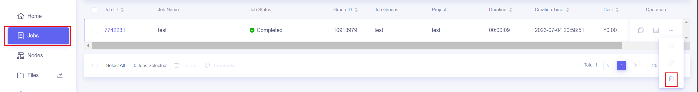
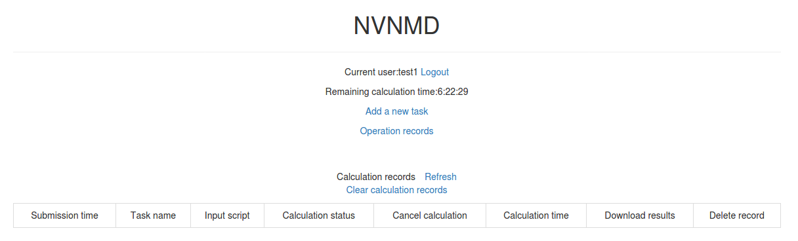
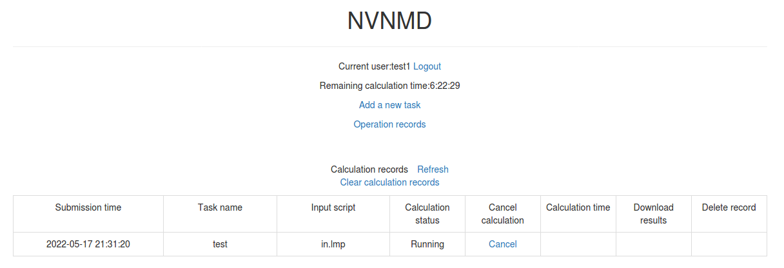

# Introduction {{ tensorflow_icon }}

:::{note}
**Supported backends**: TensorFlow {{ tensorflow_icon }}
:::

NVNMD stands for non-von Neumann molecular dynamics.

This is the training code we used to generate the results in our paper entitled "Accurate and Efficient Molecular Dynamics based on Machine Learning and non von Neumann Architecture", which has been accepted by npj Computational Materials ([DOI: 10.1038/s41524-022-00773-z](https://www.nature.com/articles/s41524-022-00773-z)).

Any user can follow two consecutive steps to run molecular dynamics (MD) on the proposed NVNMD computer, which has been released online: (i) to train a machine learning (ML) model that can decently reproduce the potential energy surface (PES); and (ii) to deploy the trained ML model on the proposed NVNMD computer, then run MD there to obtain the atomistic trajectories.

## Training

Our training procedure consists of not only continuous neural network (CNN) training but also quantized neural network (QNN) training which uses the results of CNN as inputs. It is performed on CPU or GPU by using the training codes we open-sourced online.

To train an ML model that can decently reproduce the PES, a training and testing data set should be prepared first. This can be done by using either the state-of-the-art active learning tools or the outdated (i.e., less efficient) brute-force density functional theory (DFT)-based ab-initio molecular dynamics (AIMD) sampling.

If you just want to simply test the training function, you can use the example in the `$deepmd_source_dir/examples/nvnmd` directory. If you want to fully experience training and running MD functions, you can download the complete example from the [website](https://github.com/LiuGroupHNU/nvnmd-example).

Then, copy the data set to the working directory

```bash
mkdir -p $workspace
cd $workspace
mkdir -p data
cp -r $dataset data
```

where `$dataset` is the path to the data set and `$workspace` is the path to the working directory.

## Input script

Create and go to the training directory.

```bash
mkdir train
cd train
```

Then copy the input script `train_cnn.json` and `train_qnn.json` to the directory `train`

```bash
cp -r $deepmd_source_dir/examples/nvnmd/train/train_cnn.json train_cnn.json
cp -r $deepmd_source_dir/examples/nvnmd/train/train_qnn.json train_qnn.json
```

The structure of the input script is as follows

```json
{
  "nvnmd": {},
  "learning_rate": {},
  "loss": {},
  "training": {}
}
```

### nvnmd

The "nvnmd" section is defined as

```json
{
  "version": 0,
  "max_nnei": 128,
  "net_size": 128,
  "sel": [60, 60],
  "rcut": 6.0,
  "rcut_smth": 0.5,
  "type_map": ["Ge", "Te"]
}
```

where items are defined as:

| Item      | Mean                                                                  | Optional Value                                                               |
| --------- | --------------------------------------------------------------------- | ---------------------------------------------------------------------------- |
| version   | the version of network structure                                      | 0 or 1                                                                       |
| max_nnei  | the maximum number of neighbors that do not distinguish element types | 128 or 256                                                                   |
| net_size  | the size of neural network                                            | 128                                                                          |
| sel       | the number of neighbors                                               | version 0: integer list of lengths 1 to 4 are acceptable; version 1: integer |
| rcut      | the cutoff radial                                                     | (0, 8.0]                                                                     |
| rcut_smth | the smooth cutoff parameter                                           | (0, 8.0]                                                                     |
| type_map  | mapping atom type to the name (str) of the type                       | string list, optional                                                        |

Multiple versions of the nvnmd model correspond to different network structures. `nvnmd-v0` and `nvnmd-v1` differ in the following ways:

1. `nvnmd-v0` and `nvnmd-v1` use the `se_a` descriptor and `se_atten` descriptor, respectively
2. `nvnmd-v0` has 1 set of parameters for each element and supports up to 4 element types. `nvnmd-v1` shares 1 set of parameters for each element and supports up to 31 types.
3. `nvnmd-v0` distinguishes between neighboring atoms, so `sel` is a list of integers. `nvnmd-v1` does not distinguish between neighboring atoms, so `sel` is an integer.

### learning_rate

The "learning_rate" section is defined as

```json
{
  "type": "exp",
  "start_lr": 1e-3,
  "stop_lr": 3e-8,
  "decay_steps": 5000
}
```

where items are defined as:

| Item        | Mean                                                             | Optional Value         |
| ----------- | ---------------------------------------------------------------- | ---------------------- |
| type        | learning rate variant type                                       | exp                    |
| start_lr    | the learning rate at the beginning of the training               | a positive real number |
| stop_lr     | the desired learning rate at the end of the training             | a positive real number |
| decay_stops | the learning rate is decaying every {decay_stops} training steps | a positive integer     |

### loss

The "loss" section is defined as

```json
{
  "start_pref_e": 0.02,
  "limit_pref_e": 2,
  "start_pref_f": 1000,
  "limit_pref_f": 1,
  "start_pref_v": 0,
  "limit_pref_v": 0
}
```

where items are defined as:

| Item         | Mean                                                       | Optional Value               |
| ------------ | ---------------------------------------------------------- | ---------------------------- |
| start_pref_e | the loss factor of energy at the beginning of the training | zero or positive real number |
| limit_pref_e | the loss factor of energy at the end of the training       | zero or positive real number |
| start_pref_f | the loss factor of force at the beginning of the training  | zero or positive real number |
| limit_pref_f | the loss factor of force at the end of the training        | zero or positive real number |
| start_pref_v | the loss factor of virial at the beginning of the training | zero or positive real number |
| limit_pref_v | the loss factor of virial at the end of the training       | zero or positive real number |

### training

The "training" section is defined as

```json
{
  "seed": 1,
  "stop_batch": 1000000,
  "numb_test": 1,
  "disp_file": "lcurve.out",
  "disp_freq": 1000,
  "save_ckpt": "model.ckpt",
  "save_freq": 10000,
  "training_data": {
    "systems": ["system1_path", "system2_path", "..."],
    "batch_size": ["batch_size_of_system1", "batch_size_of_system2", "..."]
  }
}
```

where items are defined as:

| Item       | Mean                                                | Optional Value     |
| ---------- | --------------------------------------------------- | ------------------ |
| seed       | the random seed                                     | a integer          |
| stop_batch | the total training steps                            | a positive integer |
| numb_test  | the accuracy is test by using {numb_test} sample    | a positive integer |
| disp_file  | the log file where the training message display     | a string           |
| disp_freq  | display frequency                                   | a positive integer |
| save_ckpt  | path prefix of check point files                    | a string           |
| save_freq  | save frequency                                      | a positive integer |
| systems    | a list of data directory which contains the dataset | string list        |
| batch_size | a list of batch size of corresponding dataset       | a integer list     |

## Training

Training can be invoked by

```bash
# step1: train CNN
dp train-nvnmd train_cnn.json -s s1
# step2: train QNN
dp train-nvnmd train_qnn.json -s s2
```

After the training process, you will get two folders: `nvnmd_cnn` and `nvnmd_qnn`. The `nvnmd_cnn` contains the model after continuous neural network (CNN) training. The `nvnmd_qnn` contains the model after quantized neural network (QNN) training. The binary file `nvnmd_qnn/model.pb` is the model file that is used to perform NVNMD in the server [http://nvnmd.picp.vip].

You can also restart the CNN training from the path prefix of checkpoint files (`nvnmd_cnn/model.ckpt`) by

```bash
dp train-nvnmd train_cnn.json -r nvnmd_cnn/model.ckpt -s s1
```

You can also initialize the CNN model and train it by

```bash
mv nvnmd_cnn nvnmd_cnn_bck
cp train_cnn.json train_cnn2.json
# please edit train_cnn2.json
dp train-nvnmd train_cnn2.json -s s1 -i nvnmd_cnn_bck/model.ckpt
```

# Testing

The frozen model can be used in many ways. The most straightforward testing can be invoked by

```bash
mkdir test
dp test -m ./nvnmd_qnn/frozen_model.pb -s path/to/system -d ./test/detail -n 99999 -l test/output.log
```

where the frozen model file to import is given via the `-m` command line flag, the path to the testing data set is given via the `-s` command line flag, and the file containing details of energy, forces and virials accuracy is given via the `-d` command line flag, the amount of data for testing is given via the `-n` command line flag.

# Running MD in Bohrium

After CNN and QNN training, you can upload the ML model to our online NVNMD system and run MD there through Bohrium (https://bohrium.dp.tech). Bohrium is a research platform designed for AI for Science Era. For more information, please refer to [Bohrium Introduction](https://bohrium-doc.dp.tech/en/docs/WhatIsBohrium/).

## Registration

Click [here](https://bohrium.dp.tech/login) to register a Bohrium account. If you already have an account for other DP products, you can skip this step and log in directly.

## Top-up and create a project

After entering the homepage, you can click on the `User Center` in the lower left corner to top-up by yourself.


After completing the top-up, click on the `Projects`, and then click `New Project` in the upper right corner of the page. Give the project a name that is easy for you to recognize and click `OK`. If the project has other collaborators, you can refer to [Project Collaboration](https://bohrium-doc.dp.tech/en/docs/userguide/coorperation/) for more information.


## Run job

We will use Utility to submit jobs, you can install it with the following command

```bash
pip install lbg
```

When using the Lebesgue Utility for the first time, you need to configure your account by

```bash
lbg config account
```

Enter your Bohrium account and the corresponding password.

Then you need prepare the configuration file `job.json`, the configuration file is as follows

```json
{
  "job_name": "test",
  "command": "/usr/bin/lmp_mpi < in.lmp;",
  "log_file": "OUTCAR",
  "machine_type": "c4_m16_cpu",
  "job_type": "container",
  "image_name": "lammps_dp:29Sep2021",
  "platform": "hnugba",
  "region": "default",
  "project_id": 0000
}
```

where items are defined as:

| Item         | Mean                                                                                                                       | Optional Value                          |
| ------------ | -------------------------------------------------------------------------------------------------------------------------- | --------------------------------------- |
| job_name     | the name of computing job, which can be named freely                                                                       | a string                                |
| command      | the command to be executed on the computing node                                                                           | a string                                |
| log_file     | the log file that can be viewed at any time during the calculation process, which can be viewed on the Bohrium "Jobs" page | a string                                |
| machine_type | the machine type used for the job                                                                                          | "c1_m4_cpu", "c4_m16_cpu", "c8_m32_cpu" |
| job_type     | the job type                                                                                                               | "container"                             |
| image_name   | the image name used for the job                                                                                            | "lammps_dp:29Sep2021"                   |
| platform     | resource provider                                                                                                          | "hnugba"                                |
| project_id   | the project ID to which the job belongs, which can be viewed on the "Projects" page                                        | a integer                               |

Notice：The task will use 4 CPU cores for computation, so do not repeatedly use the `mpirun` command, otherwise an error will be reported. All 0000 after "project_id" need to be replaced with your own project ID, which can be viewed on the "Projects" page. Also, the JSON file format requires that no commas be added after the last field within the {}, otherwise, there will be a syntax error. Please check the [documentation](https://github.com/LiuGroupHNU/md-data/blob/master/code/doc/mdpu/hardware.md) for the latest hardware configuration information.

In addition, it is necessary to prepare input script of the MD simulation, the ML model named `model.pb` obtained by QNN training and data files containing information required for running an MD simulation (e.g., `coord.lmp` containing initial atom coordinates).

In the input script, one needs to specify the pair style as follows

```lammps
pair_style nvnmd model.pb
pair_coeff * *
```

where `model.pb` is the path to model.

After preparing the configuration file and the required files for calculation, using Lebesgue Utility to submit the job

```bash
lbg job submit -i job.json -p ./
```

where the configuration file for the job is given via the `-i` command line flag, the directory where the input files are located is given via the `-p` command line flag. Bohrium will package and upload the specified directory, and after decompressing it on the computing node, it will switch the working directory to that directory.

After the job is submitted successfully, the JOB ID and JOB GROUP ID will be output.


## Check job status

After successfully submitting the job, you can view the progress and related logs of the submitted jobs on the `Jobs` page.


## Terminate and delete jobs

You can choose between `terminate` and `delete` operations.

- Terminate: To end running jobs/job groups in advance, save the generated result files, and the status of the terminated jobs will be changed to "completed".

- Delete: To end running jobs/job groups, the status of the jobs will be changed to "failed". Job result files will be deleted, and the jobs/job groups disappear from the list. The delete operation cannot be undone.

The Jobs page provides buttons to end jobs and job groups




You can also use the Lebesgue Utility tool to end jobs

```bash
lbg jobgroup terminate <JOB GROUP ID>
```

```bash
lbg job terminate <JOB ID>
```

```bash
lbg jobgroup rm <JOB GROUP ID>
```

```bash
lbg job rm <JOB ID>
```

## Download Results

After the calculation is completed, you can download the results on the `Jobs` page, or save them to the data disk.


You can also download it using the commands of Lebesgue Utility

```bash
lbg job download <JOB ID>
```

or

```bash
lbg jobgroup download <JOB GROUP ID>
```

# Running MD in Nvnmd website

After CNN and QNN training, you can upload the ML model to our online NVNMD system and run MD there.

## Account application

The server website of NVNMD is available at http://nvnmd.picp.vip. You can visit the URL and enter the login interface.


To obtain an account, please send your application to the email (jie_liu@hnu.edu.cn, liujie@uw.edu). The username and password will be sent to you by email.

## Adding task

After successfully obtaining the account, enter the username and password in the login interface, and click "Login" to enter the homepage.



The homepage displays the remaining calculation time and all calculation records not deleted. Click `Add a new task` to enter the interface for adding a new task.


- Task name: name of the task
- Upload mode: two modes of uploading results to online data storage, including `Manual upload` and `Automatic upload`. Results need to be uploaded manually to online data storage with `Manual upload` mode and will be uploaded automatically with `Automatic upload` mode.
- Input script: input file of the MD simulation.

In the input script, one needs to specify the pair style as follows

```lammps
pair_style nvnmd model.pb
pair_coeff * *
```

- Model file: the ML model named `model.pb` obtained by QNN training.
- Data files: data files containing the information required for running an MD simulation (e.g., `coord.lmp` containing initial atom coordinates).

Next, you can click `Submit` to submit the task and then automatically return to the homepage.



Then, click `Refresh` to view the latest status of all calculation tasks.

## Cancelling calculation

For the task whose calculation status is `Pending` and `Running`, you can click the corresponding `Cancel` on the homepage to stop the calculation.


## Downloading results

For the task whose calculation status is `Completed`, `Failed` and `Cancelled`, you can click the corresponding `Package` or `Separate files` in the `Download results` bar on the homepage to download results.

Click `Package` to download a zipped package of all files including input files and output results.


Click `Separate files` to download the required separate files.


If `Manual upload` mode is selected or the file has expired, click `Upload` on the download interface to upload manually.

## Deleting record

For the task no longer needed, you can click the corresponding `Delete` on the homepage to delete the record.

Records cannot be retrieved after deletion.

## Clearing records

Click `Clear calculation records` on the homepage to clear all records.

Records cannot be retrieved after clearing.
