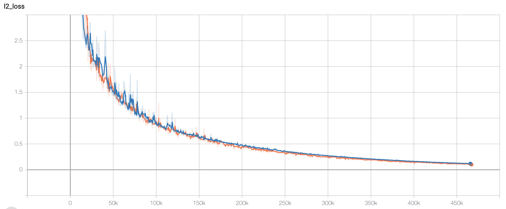
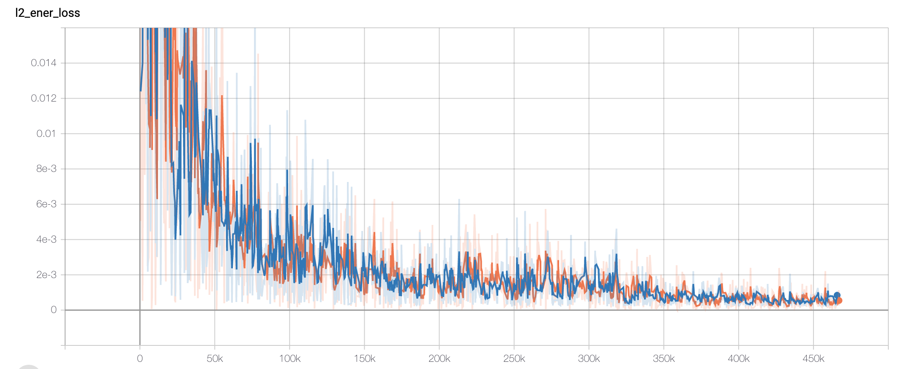
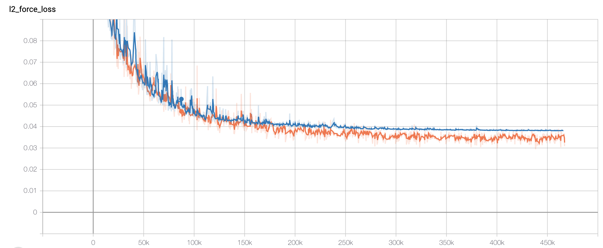
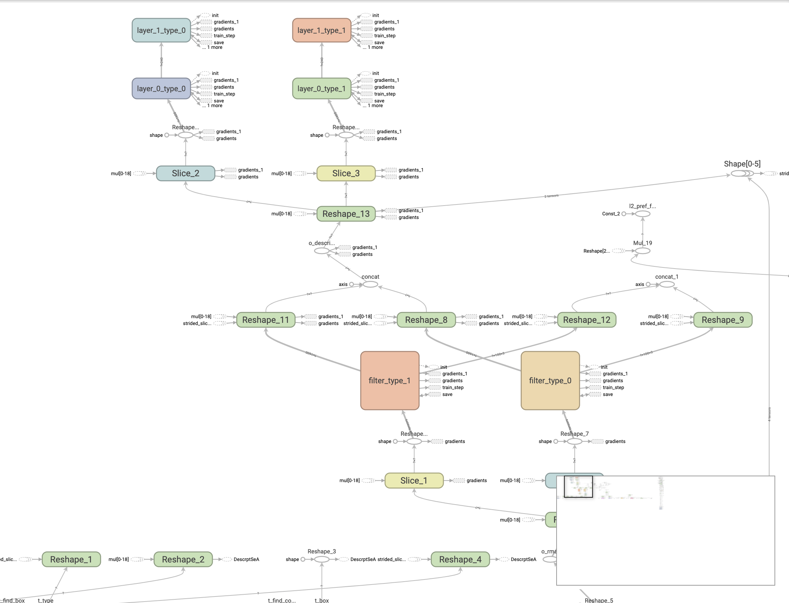
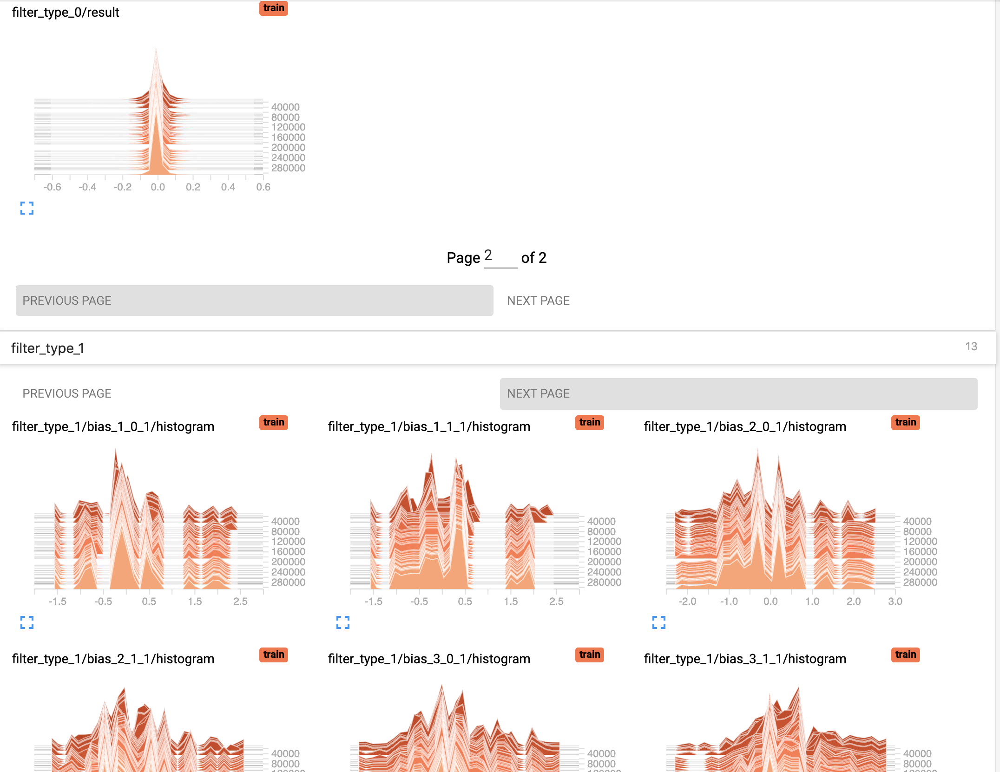
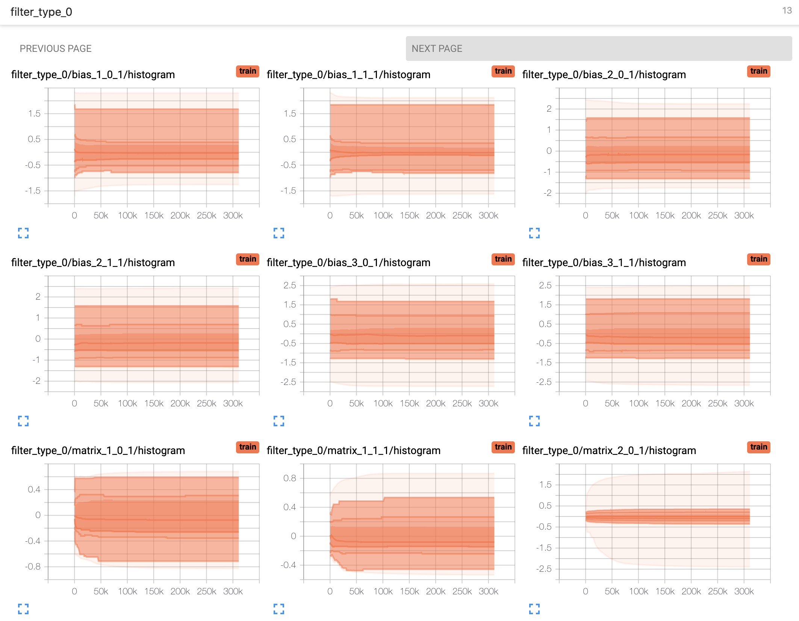
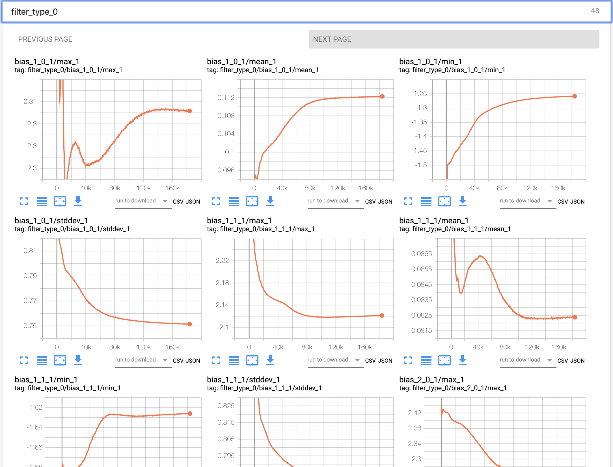

# DeePMD-kit TensorBoard usage

TensorBoard provides the visualization and tooling needed for machine learning
experimentation. A full instruction of tensorboard can be found
[here](https://tensorflow.google.cn/tensorboard).

## Highlighted features

DeePMD-kit can now use most of the interesting features enabled by tensorboard!

* **Tracking and visualizing metrics,** such as l2_loss, l2_energy_loss and l2_force_loss
* **Visualizing the model graph** (ops and layers)
* **Viewing histograms of weights, biases, or other tensors as they change over time.**
* **Viewing summaries of trainable viriables**
  
<!-- * **Projecting embeddings to a lower dimensional space.**
* **Precision curves.** -->

## How to use Tensorboard with DeePMD-kit

Before running TensorBoard, make sure you have generated summary data in a log
directory by modifying the the input script, set "tensorboard" true in training
subsection will enable the tensorboard data analysis. eg. **water_se_a.json**.

```json
    "training" : {
	"systems":	["../data/"],
	"set_prefix":	"set",    
	"stop_batch":	1000000,
	"batch_size":	1,

	"seed":		1,

	"_comment": " display and restart",
	"_comment": " frequencies counted in batch",
	"disp_file":	"lcurve.out",
	"disp_freq":	100,
	"numb_test":	10,
	"save_freq":	1000,
	"save_ckpt":	"model.ckpt",
	"load_ckpt":	"model.ckpt",
	"disp_training":true,
	"time_training":true,
	"tensorboard":	true,
	"tensorboard_log_dir":"log",
	"profiling":	false,
	"profiling_file":"timeline.json",
	"_comment":	"that's all"
    }
```

Once you have event files, run TensorBoard and provide the log directory. This
should print that TensorBoard has started. Next, connect to http://tensorboard_server_ip:6006.

TensorBoard requires a logdir to read logs from. For info on configuring TensorBoard, run tensorboard --help.
One can easily change the log name with "tensorboard_log_dir".

```bash
tensorboard --logdir path/to/logs
```

## Examples

### Tracking and visualizing loss metrics(red:train, blue:test)







### Visualizing deepmd-kit model graph



### Viewing histograms of weights, biases, or other tensors as they change over time





### Viewing summaries of trainable variables


## Atention

**Allowing the tensorboard analysis will takes extra execution time.**(eg, 15% increasing @Nvidia GTX 1080Ti double precision with default water sample)

**TensorBoard can be used in Google Chrome or Firefox.** Other browsers might work, but there may be bugs or performance issues.
