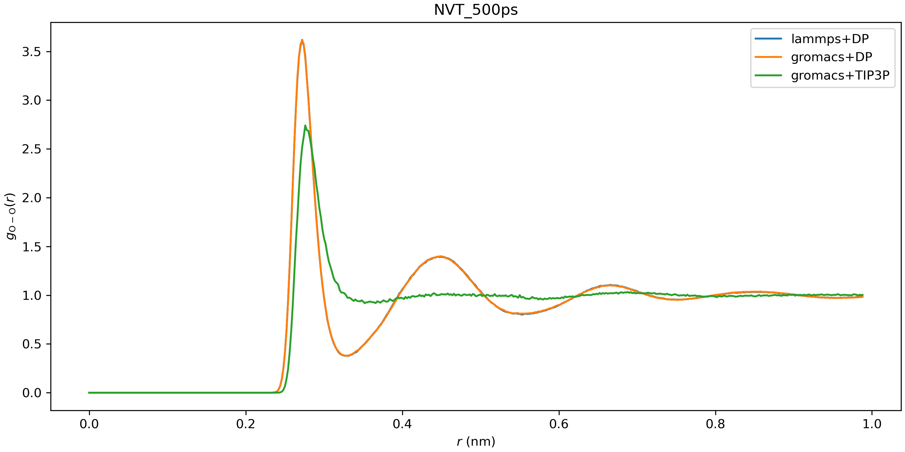

# Running MD with GROMACS

:::{note}
See [Environment variables](../env.md) for the runtime environment variables.
:::

## DP/MM Simulation

This part gives a simple tutorial on how to run a DP/MM simulation for methane in water, which means using DP for methane and TIP3P for water. All relevant files can be found in `examples/methane`.

### Topology Preparation

Similar to QM/MM simulation, the internal interactions (including bond, angle, dihedrals, LJ, Columb) of the region described by a neural network potential (NNP) have to be **turned off**. In GROMACS, bonded interactions can be turned off by modifying `[ bonds ]`, `[ angles ]`, `[ dihedrals ]` and `[ pairs ]` sections. And LJ and Columb interactions must be turned off by `[ exclusions ]` section.

For example, if one wants to simulate ethane in water, using DeepPotential for methane and TIP3P for water, the topology of methane should be like the following (as presented in `examples/methane/methane.itp`):

```
[ atomtypes ]
;name btype  mass  charge ptype    sigma  epsilon
  c3    c3   0.0     0.0     A 0.339771 0.451035
  hc    hc   0.0     0.0     A 0.260018 0.087027

[ moleculetype ]
;name            nrexcl
 methane          3

[ atoms ]
; nr type  resnr residue atom  cgnr  charge   mass
  1   c3      1     MOL   C1     1 -0.1068 12.010
  2   hc      1     MOL   H1     2  0.0267  1.008
  3   hc      1     MOL   H2     3  0.0267  1.008
  4   hc      1     MOL   H3     4  0.0267  1.008
  5   hc      1     MOL   H4     5  0.0267  1.008

[ bonds ]
; i  j  func  b0  kb
 1  2     5
 1  3     5
 1  4     5
 1  5     5

[ exclusions ]
; ai  aj1  aj2  aj3  aj4
  1    2    3    4    5
  2    1    3    4    5
  3    1    2    4    5
  4    1    2    3    5
  5    1    2    3    4
```

For comparison, the original topology file generated by `acpype` will be:

```
; methane_GMX.itp created by acpype (v: 2021-02-05T22:15:50CET) on Wed Sep  8 01:21:53 2021

[ atomtypes ]
;name   bond_type     mass     charge   ptype   sigma         epsilon       Amb
 c3       c3          0.00000  0.00000   A     3.39771e-01   4.51035e-01 ; 1.91  0.1078
 hc       hc          0.00000  0.00000   A     2.60018e-01   8.70272e-02 ; 1.46  0.0208

[ moleculetype ]
;name            nrexcl
 methane          3

[ atoms ]
;   nr  type  resi  res  atom  cgnr     charge      mass       ; qtot   bond_type
     1   c3     1   MOL    C1    1    -0.106800     12.01000 ; qtot -0.107
     2   hc     1   MOL    H1    2     0.026700      1.00800 ; qtot -0.080
     3   hc     1   MOL    H2    3     0.026700      1.00800 ; qtot -0.053
     4   hc     1   MOL    H3    4     0.026700      1.00800 ; qtot -0.027
     5   hc     1   MOL    H4    5     0.026700      1.00800 ; qtot 0.000

[ bonds ]
;   ai     aj funct   r             k
     1      2   1    1.0970e-01    3.1455e+05 ;     C1 - H1
     1      3   1    1.0970e-01    3.1455e+05 ;     C1 - H2
     1      4   1    1.0970e-01    3.1455e+05 ;     C1 - H3
     1      5   1    1.0970e-01    3.1455e+05 ;     C1 - H4

[ angles ]
;   ai     aj     ak    funct   theta         cth
     2      1      3      1    1.0758e+02    3.2635e+02 ;     H1 - C1     - H2
     2      1      4      1    1.0758e+02    3.2635e+02 ;     H1 - C1     - H3
     2      1      5      1    1.0758e+02    3.2635e+02 ;     H1 - C1     - H4
     3      1      4      1    1.0758e+02    3.2635e+02 ;     H2 - C1     - H3
     3      1      5      1    1.0758e+02    3.2635e+02 ;     H2 - C1     - H4
     4      1      5      1    1.0758e+02    3.2635e+02 ;     H3 - C1     - H4
```

### DeePMD-kit Settings

Before running simulations, we need to tell GROMACS to use DeepPotential by setting the environment variable `GMX_DEEPMD_INPUT_JSON`:

```bash
export GMX_DEEPMD_INPUT_JSON=input.json
```

Then, in your working directories, we have to write `input.json` file:

```json
{
  "graph_file": "/path/to/graph.pb",
  "type_file": "type.raw",
  "index_file": "index.raw",
  "lambda": 1.0,
  "pbc": false
}
```

Here is an explanation for these settings:

- `graph_file` : The [model file](../backend.md) generated by `dp freeze` command
- `type_file` : File to specify DP atom types (in space-separated format). Here, `type.raw` looks like

```
1 0 0 0 0
```

- `index_file` : File containing indices of DP atoms (in space-separated format), which should be consistent with the indices' order in .gro file but **starting from zero**. Here, `index.raw` looks like

```
0 1 2 3 4
```

- `lambda`: Optional, default 1.0. Used in alchemical calculations.
- `pbc`: Optional, default true. If true, the GROMACS periodic condition is passed to DeePMD-kit.

### Run Simulation

Finally, you can run GROMACS using `gmx mdrun` as usual.

## All-atom DP Simulation

This part gives an example of how to simulate all atoms described by a DeepPotential with Gromacs, taking water as an example. Instead of using `[ exclusions ]` to turn off the non-bonded energies, we can simply do this by setting LJ parameters (i.e. epsilon and sigma) and partial charges to 0, as shown in `examples/water/gmx/water.top`:

```
[ atomtypes ]
; name      at.num  mass     charge ptype  sigma      epsilon
HW           1       1.008   0.0000  A   0.00000e+00  0.00000e+00
OW           8      16.00    0.0000  A   0.00000e+00  0.00000e+00
```

As mentioned in the above section, `input.json` and relevant files (`index.raw`, `type.raw`) should also be created. Then, we can start the simulation under the NVT ensemble and plot the radial distribution function (RDF) by `gmx rdf` command. We can see that the RDF given by Gromacs+DP matches perfectly with LAMMPS+DP, which further provides an evidence on the validity of our simulation.


However, we still recommend you run an all-atom DP simulation using LAMMPS since it is more stable and efficient.
