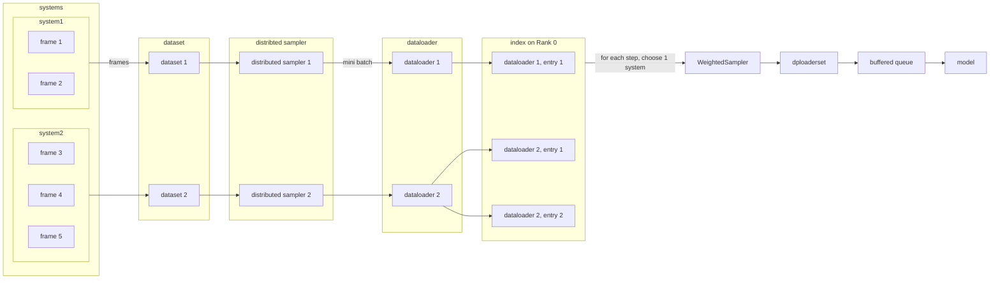

# Parallel training {{ tensorflow_icon }} {{ pytorch_icon }} {{ paddle_icon }}

:::{note}
**Supported backends**: TensorFlow {{ tensorflow_icon }}, PyTorch {{ pytorch_icon }}, Paddle {{ paddle_icon }}
:::

## TensorFlow Implementation {{ tensorflow_icon }}

Currently, parallel training in tensorflow version is enabled in a synchronized way with help of [Horovod](https://github.com/horovod/horovod).
Depending on the number of training processes (according to MPI context) and the number of GPU cards available, DeePMD-kit will decide whether to launch the training in parallel (distributed) mode or in serial mode. Therefore, no additional options are specified in your JSON/YAML input file.

### Tuning learning rate

Horovod works in the data-parallel mode, resulting in a larger global batch size. For example, the real batch size is 8 when {ref}`batch_size <training/training_data/batch_size>` is set to 2 in the input file and you launch 4 workers. Thus, {ref}`learning_rate <learning_rate>` is automatically scaled by the number of workers for better convergence. Technical details of such heuristic rule are discussed at [Accurate, Large Minibatch SGD: Training ImageNet in 1 Hour](https://arxiv.org/abs/1706.02677).

The number of decay steps required to achieve the same accuracy can decrease by the number of cards (e.g., 1/2 of steps in the above case), but needs to be scaled manually in the input file.

In some cases, it won't work well when scaling the learning rate by worker count in a `linear` way. Then you can try `sqrt` or `none` by setting argument {ref}`scale_by_worker <learning_rate/scale_by_worker>` like below.

```json
    "learning_rate" :{
        "scale_by_worker": "none",
        "type": "exp"
    }
```

### Scaling test

Testing `examples/water/se_e2_a` on an 8-GPU host, linear acceleration can be observed with the increasing number of cards.
In this example, the number of samples per batch on a single GPU card ({ref}`batch_size <training/training_data/batch_size>`) is set to `1`.

| Num of GPU cards | Samples per batch | Seconds every 100 batches | Samples per second | Speed up |
| ---------------- | ----------------- | ------------------------- | ------------------ | -------- |
| 1                | 1                 | 1.4515                    | 68.89              | 1.00     |
| 2                | 2                 | 1.5962                    | 62.65\*2           | 1.82     |
| 4                | 4                 | 1.7635                    | 56.71\*4           | 3.29     |
| 8                | 8                 | 1.7267                    | 57.91\*8           | 6.72     |

### How to use

Training workers can be launched with `horovodrun`. The following command launches 4 processes on the same host:

```bash
CUDA_VISIBLE_DEVICES=4,5,6,7 horovodrun -np 4 \
    dp train --mpi-log=workers input.json
```

Need to mention, the environment variable `CUDA_VISIBLE_DEVICES` must be set to control parallelism on the occupied host where one process is bound to one GPU card.

To maximize the performance, one should follow [FAQ: How to control the parallelism of a job](../troubleshooting/howtoset_num_nodes.md) to control the number of threads.

When using MPI with Horovod, `horovodrun` is a simple wrapper around `mpirun`. In the case where fine-grained control over options is passed to `mpirun`, [`mpirun` can be invoked directly](https://horovod.readthedocs.io/en/stable/mpi_include.html), and it will be detected automatically by Horovod, e.g.,

```bash
CUDA_VISIBLE_DEVICES=4,5,6,7 mpirun -l -launcher=fork -hosts=localhost -np 4 \
    dp train --mpi-log=workers input.json
```

this is sometimes necessary for an HPC environment.

Whether distributed workers are initiated can be observed in the "Summary of the training" section in the log (`world size` > 1, and `distributed`).

```
[0] DEEPMD INFO    ---Summary of the training---------------------------------------
[0] DEEPMD INFO    distributed
[0] DEEPMD INFO    world size:           4
[0] DEEPMD INFO    my rank:              0
[0] DEEPMD INFO    node list:            ['exp-13-57']
[0] DEEPMD INFO    running on:           exp-13-57
[0] DEEPMD INFO    computing device:     gpu:0
[0] DEEPMD INFO    CUDA_VISIBLE_DEVICES: 0,1,2,3
[0] DEEPMD INFO    Count of visible GPU: 4
[0] DEEPMD INFO    num_intra_threads:    0
[0] DEEPMD INFO    num_inter_threads:    0
[0] DEEPMD INFO    -----------------------------------------------------------------
```

### Logging

What's more, 2 command-line arguments are defined to control the logging behavior when performing parallel training with MPI.

```
optional arguments:
  -l LOG_PATH, --log-path LOG_PATH
                        set log file to log messages to disk, if not
                        specified, the logs will only be output to console
                        (default: None)
  -m {master,collect,workers}, --mpi-log {master,collect,workers}
                        Set the manner of logging when running with MPI.
                        'master' logs only on main process, 'collect'
                        broadcasts logs from workers to master and 'workers'
                        means each process will output its own log (default:
                        master)
```

## PyTorch Implementation {{ pytorch_icon }}

Currently, parallel training in pytorch version is implemented in the form of PyTorch Distributed Data Parallelism [DDP](https://pytorch.org/docs/stable/generated/torch.nn.parallel.DistributedDataParallel.html).
DeePMD-kit will decide whether to launch the training in parallel (distributed) mode or in serial mode depending on your execution command.

### Dataloader and Dataset

One of the major differences between two backends during training is that the PyTorch version employs a multi-threaded data loading utility [DataLoader](https://pytorch.org/docs/stable/data.html).
We utilize the PyTorch framework and have designed and implemented a multiprocessing data processing and loading system called DpLoaderSet based on torch DataLoader and Dataset.

First, we establish a DeepmdData class for each system, which is consistent with the TensorFlow version in this level. Then, we create a dataloader for each system, resulting in the same number of dataloaders as the number of systems. Next, we create a dataset for the dataloaders obtained in the previous step. This allows us to query the data for each system through this dataset, while the iteration pointers for each system are maintained by their respective dataloaders. Finally, a dataloader is created for the outermost dataset.

We achieve custom sampling methods using a weighted sampler. The length of the sampler is set to total_batch_num \* num_workers.The parameter "num_workers" defines the number of threads involved in multi-threaded loading, which can be modified by setting the environment variable NUM_WORKERS (default: min(8, ncpus)).

> **Note** The underlying dataloader will use a distributed sampler to ensure that each GPU receives batches with different content in parallel mode, which will use sequential sampler in serial mode. In the TensorFlow version, Horovod shuffles the dataset using different random seeds for the same purpose..



### How to use

We use [`torchrun`](https://pytorch.org/docs/stable/elastic/run.html#usage) to launch a DDP training session.

To start training with multiple GPUs in one node, set parameter `nproc_per_node` as the number of it:

```bash
torchrun --nproc_per_node=4 --no-python dp --pt train input.json
# Not setting `nproc_per_node` uses only 1 GPU
torchrun --no-python dp --pt train input.json
```

To train a model with a cluster, one can manually launch the task using the commands below (usually this should be done by your job management system). Set `nnodes` as the number of available nodes, `node_rank` as the rank of the current node among all nodes (not the rank of processes!), and `nproc_per_node` as the number of available GPUs in one node. Please make sure that every node can access the rendezvous address and port (`rdzv_endpoint` in the command), and has a same amount of GPUs.

```bash
# Running DDP on 2 nodes with 4 GPUs each
# On node 0:
torchrun --rdzv_endpoint=node0:12321 --nnodes=2 --nproc_per_node=4 --node_rank=0 --no_python dp --pt train tests/water/se_e2_a.json
# On node 1:
torchrun --rdzv_endpoint=node0:12321 --nnodes=2 --nproc_per_node=4 --node_rank=1 --no_python dp --pt train tests/water/se_e2_a.json
```

> **Note** Set environment variables to tune [CPU specific optimizations](https://pytorch.org/tutorials/recipes/recipes/tuning_guide.html#cpu-specific-optimizations) in advance.

> **Note** for developers: `torchrun` by default passes settings as environment variables [(list here)](https://pytorch.org/docs/stable/elastic/run.html#environment-variables).

> To check forward, backward, and communication time, please set env var `TORCH_CPP_LOG_LEVEL=INFO TORCH_DISTRIBUTED_DEBUG=DETAIL`. More details can be found [here](https://pytorch.org/docs/stable/distributed.html#logging).

## Paddle Implementation {{ paddle_icon }}

### How to use

We use [`paddle.distributed.fleet`](https://www.paddlepaddle.org.cn/documentation/docs/zh/guides/06_distributed_training/cluster_quick_start_collective_cn.html) to launch a DDP training session.

To start training with multiple GPUs in one node, set environment variable `CUDA_VISIBLE_DEVICES` as the list of GPUs you want to use:

```bash
# example for training with 4 gpus in one node
NUM_WORKERS=0 HDF5_USE_FILE_LOCKING=0 CUDA_VISIBLE_DEVICES=0,1,2,3 python -m paddle.distributed.launch --gpus="0,1,2,3" dp --pd train input.json
```

Suppose you have 2 nodes each with 4 GPUs and their ip address are: `192.168.1.2` and `192.168.1.3`, then you can use `paddle.distributed.launch` to launch a DDP training session:

```bash
# run in node 192.168.1.2
NUM_WORKERS=0 HDF5_USE_FILE_LOCKING=0 python -m paddle.distributed.launch \
    --gpus=0,1,2,3 \
    --ips=192.168.1.2,192.168.1.3 \
    dp --pd train input.json

# then run in the other node 192.168.1.3
NUM_WORKERS=0 HDF5_USE_FILE_LOCKING=0 python -m paddle.distributed.launch \
    --gpus=0,1,2,3 \
    --ips=192.168.1.2,192.168.1.3 \
    dp --pd train input.json
```

:::{note}

If `NUM_WORKERS` is too large, it may cause the program to be terminated by the system;
if it is too small, it may slow down data reading. You can try adjusting it to an appropriate size.

:::
