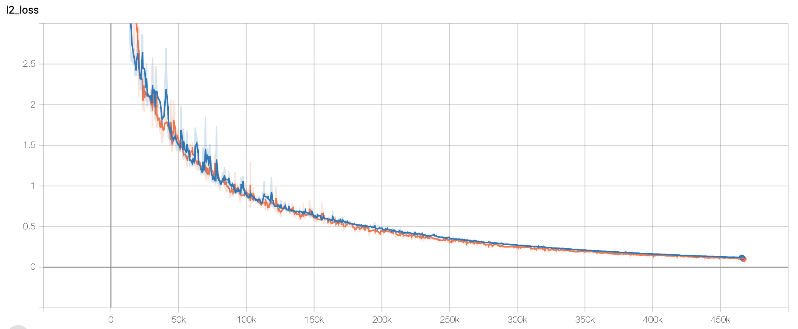
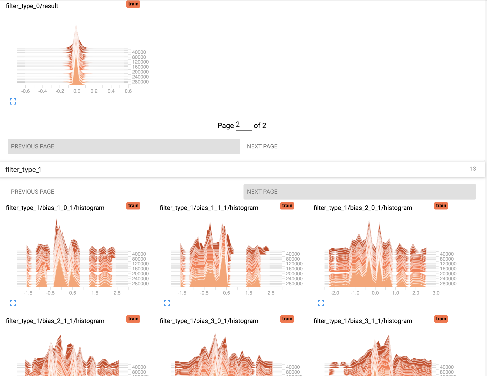

# TensorBoard Usage {{ tensorflow_icon }} {{ pytorch_icon }} {{ paddle_icon }}

:::{note}
**Supported backends**: TensorFlow {{ tensorflow_icon }}, PyTorch {{ pytorch_icon }}, Paddle {{ paddle_icon }}
:::

TensorBoard provides the visualization and tooling needed for machine learning
experimentation. Full instructions for TensorBoard can be found
[here](https://tensorflow.google.cn/tensorboard).

## Highlighted features

DeePMD-kit can now use most of the interesting features enabled by TensorBoard!

- **Tracking and visualizing metrics,** such as l2_loss, l2_energy_loss and l2_force_loss
- **Visualizing the model graph** (ops and layers)
- **Viewing histograms of weights, biases, or other tensors as they change over time.**
- **Viewing summaries of trainable variables**

<!-- * **Projecting embeddings to a lower dimensional space.**
* **Precision curves.** -->

## How to use Tensorboard with DeePMD-kit

Before running TensorBoard, make sure you have generated summary data in a log
directory by modifying the input script, setting {ref}`tensorboard <training/tensorboard>` to true in the training subsection will enable the TensorBoard data analysis. eg. **water_se_a.json**.

```json
"training": {
   "systems": ["../data/"],
   "stop_batch": 1000000,
   "batch_size": 1,

   "seed": 1,
   "_comment": " display and restart",
   "_comment": " frequencies counted in batch",
   "disp_file": "lcurve.out",
   "disp_freq": 100,
   "numb_test": 10,
   "save_freq": 1000,
   "save_ckpt": "model.ckpt",

   "disp_training": true,
   "time_training": true,
   "tensorboard": true,
   "tensorboard_log_dir": "log",
   "tensorboard_freq": 1000,
   "profiling": false,
   "profiling_file": "timeline.json",
   "_comment": "that's all"
}
```

Once you have event files, run TensorBoard and provide the log directory. This
should print that TensorBoard has started. Next, connect to http://tensorboard_server_ip:6006.

TensorBoard requires a logdir to read logs from. For info on configuring TensorBoard, run `tensorboard --help`.
One can easily change the log name with "tensorboard_log_dir" and the sampling frequency with "tensorboard_freq".

```bash
tensorboard --logdir path/to/logs
```

## PyTorch Profiler With TensorBoard {{ pytorch_icon }}

DeePMD-kit has a built-in support for [PyTorch Profiler](https://pytorch.org/tutorials/intermediate/tensorboard_profiler_tutorial.html#use-profiler-to-record-execution-events).
The profiler requires extra packages for recording and visualization:
`pip install tensorboard torch-tb-profiler`
Set `"enable_profiler": true` in the training section of the input script, and launch a training task with 10 steps, since the default setting of the profiler scheduler is `wait=1, warmup=1, active=3, repeat=1`.
The profiler will generate recording files in `tensorboard_log_dir`.

To [visualize the profiling data](https://pytorch.org/tutorials/intermediate/tensorboard_profiler_tutorial.html#use-tensorboard-to-view-results-and-analyze-model-performance), launch TensorBoard (see above) and navigate to the "pytorch_profiler" tab.

## Examples

### Tracking and visualizing loss metrics(red:train, blue:test)




### Visualizing DeePMD-kit model graph


### Viewing histograms of weights, biases, or other tensors as they change over time




### Viewing summaries of trainable variables


## Attention

**Allowing the tensorboard analysis will takes extra execution time.**(eg, 15% increasing @Nvidia GTX 1080Ti double precision with default water sample)

**TensorBoard can be used in Google Chrome or Firefox.** Other browsers might work, but there may be bugs or performance issues.
